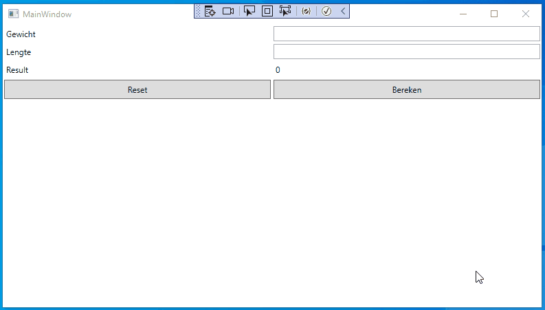

author: Matthias Druwé
summary: BmiCalculator met MVVM
id: BmiCalculator-met-MVVM
categories: dotNet
tags: ptt
environments: dotNet
status: Draft
feedback link: mailto:matthias.druwe@gmail.com?subject=Problems with: BmiCalculator-met-MVVM

# BmiCalculator met MVVM

## Introductie

In dit codelab maken we een BMI rekenmachine in combinatie met het MVVM patroon. Specifiek voor deze applicatie zullen we enkel gebruik maken van een view en een viewModel. Binnen de context van de applicatie is het niet nuttig om een Model te definiëren dus in deze applicatie zal deze niet gebruikt worden.

### Opgave

Vul de applicatie aan zodat het mogelijk is om het bmi van een persoon te berekenen. De applicatie bestaat uit 2 invoervelden, waar het gewicht (in kg) en de lengte (in meter) moet worden ingegeven. Daarnaast zijn er twee knoppen. Met de reset knop kunnen we alle velden leeg maken. Met Bereken knop wordt de BMI berekent. De applicatie duidt ook met een achtergrond kleur aan hoe goed/slecht de BMI is.

### Start repo

Voor deze oefening kan je de startcode vinden op [github](https://github.com/OdiseePTT/BMICalculator).

#### Inhoud

In de startrepo kan je reeds een XAML file met een lay-out terug vinden. De view bestaat uit 2 input velden voor gewicht en lengte. Daarnaast zijn er 2 knoppen. Éen knop gebruiken we om de BMI te berekenen, met de andere knop resetten we de velden. Tot slot zijn er nog 4 labels, 3 van deze labels zijn reeds zichtbaar en bevatten content. In het 4de label gaan we het resultaat van de BMI berekening plaatsen.

Positive
: Check zelf zeker alle aanwezig code of je alles begrijpt. Indien niet vraag het aan de docent!

## Demo

Hieronder een demo van de afgewerkte applicatie.



## ViewModel

In een eerste stap maken we het ViewModel. In deze stap gaan we nog niet de koppeling maken met de View. Wel voorzien we de nodige properties.

### MainViewModel

Maak een nieuwe file aan met een klasse MainViewModel.

```c#
namespace BMICalculator
{
    internal class MainViewModel
    {
    }
}
```

### Properties aanvullen

We willen in onze view 4 dingen kunnen uitlezen of aanpassen. Dit wil zeggen dat we hiervoor 4 properties.

- gewicht (type double)
- lengte (type double)
- achtergrondkleur (type Brush, hiervoor heb je een extra import nodig)
- bmi (type double)

Vul de klasse aan met bovenstaande properties.

```c#
using System.Windows.Media;

namespace BMICalculator
{
    internal class MainViewModel
    {
        public double? Weight { get; set; }
        public double? Length { get; set; }
        public double? Bmi { get; private set; }
        public Brush BackgroundColor { get; private set; }
    }
}
```

Hierboven zien we bij de types een vraagteken staan. Dit vraagteken duidt aan dat deze properties NULL kunnen zijn. Zonder dit vraagteken doet de compiler moeilijk om NULL waardes in een property te plaatsen. De reden dat we dit hier doen, is omdat we in de applicatie de invoervelden leeg willen kunnen maken. Dit kunnen we doen door in deze properties ook NULL toe te laten.

Ook kiezen we er voor om de properties Bmi en BackgroundColor een private setter te geven. Hiermee voorkomen we dat deze vanuit een andere klasse kunnen aangepast worden. Deze properties zijn afhankelijk van gewicht en lengte. We mogen dus niet toelaten dat de Bmi en achtergrondkleur (per toeval) vanuit een andere klasse worden aangepast.

### Acties opvangen

In tegenstelling tot een klassieke WPF applicatie met een codebehind, gaan we geen gebruik maken van eventhandlers. Om events op te vangen maken we gebruik van commands. Een command is een manier om via een afgesproken manier de juiste methode aan te spreken. Hiervoor maken we gebruik van een interface ICommand (dit komt later in de volgende lessen gedetailleerd aan bod).
We maken 2 properties (reset en calculate) aan die van het type ICommand zijn.

```c#
using System.Windows.Input;
using System.Windows.Media;

namespace BMICalculator
{
    internal class MainViewModel
    {
        ...

        public ICommand CalculateCommand { get; private set; }
        public ICommand ResetCommand { get; private set; }
    }
}

```

We maken hier terug gebruik van private setters. Indien deze setters niet private zouden zijn, zou het mogelijk zijn dat vanuit een andere klasse deze commands overschreven kunnen worden. Wanneer dit het geval is, wordt de bedoelde functionaliteit kapot gemaakt.

Hierboven schreven we dat we via deze commands de juiste methode kunnen aanspreken. Hiervoor moeten we de properties initialiseren met een object. We kunnen van een interface geen object maken (zoals we later gaan zien). We moeten dus eerst nog een klasse maken die voldoet aan de interface van ICommand. Deze mag je van hieronder gewoon overnemen. Plaats dit in een nieuwe file ActionCommand

```c#
using System;
using System.Windows.Input;

namespace BMICalculator
{
    internal class ActionCommand : ICommand
    {
        public event EventHandler CanExecuteChanged;

        private Action action;

        public ActionCommand(Action action)
        {
            this.action = action;
        }

        public bool CanExecute(object parameter)
        {
            return action != null;
        }

        public void Execute(object parameter)
        {
            action();
        }
    }
}
```

Nu kunnen we deze klasse gebruiken om het ResetCommand en CalculateCommand in te stellen. Alvorens we dit doen moeten we ook 2 methodes voorzien die er voor zorgen dat de juiste acties gebeuren.

Één methode gaat er voor zorgen dat het BMI correct berekend wordt en de achtergrondkleur van ons scherm correct wordt getoond. We gaan deze methode CalculateCommandAction noemen. Deze methode moet private zijn aangezien deze niet extern aangesproken hoeft te worden.

```c#
private void CalculateCommandAction()
{
    Bmi = Weight / (Length * Length);
    if (Bmi < 18.5)
    {
        BackgroundColor = Brushes.LightBlue;
    }
    else if (Bmi < 25)
    {
        BackgroundColor = Brushes.Green;
    }
    else if (Bmi < 30)
    {
        BackgroundColor = Brushes.Yellow;
    }
    else if (Bmi < 35)
    {
        BackgroundColor = Brushes.Orange;
    }
    else if (Bmi < 40)
    {
        BackgroundColor = Brushes.OrangeRed;
    }
    else
    {
        BackgroundColor = Brushes.DarkRed;
    }
}
```

De tweede methode die we nodig hebt moet er voor zorgen dat alle instelling leeg gemaakt worden. Hiervoor maken we een methode `ResetCommandAction`.

```c#
private void ResetCommandAction()
{
    Weight = null;
    Length = null;
    Bmi = null;
    BackgroundColor = null;
}
```

Deze twee methodes dienen nog gekoppeld te worden aan onze property met behulp van de ActionCommand klasse. Deze initialisatie doen we in de constructor van het viewmodel. Atypisch is hier dat we een methode als parameter meegeven in plaats van een object.

```c#
public MainViewModel()
{
    CalculateCommand = new ActionCommand(CalculateCommandAction);
    ResetCommand = new ActionCommand(ResetCommandAction);
}
```

Op dit moment is de basis van ons viewModel klaar. In de volgende stappen gaan we dit nog verder uitbreiden.

## ViewModel koppelen aan View

Wanneer een View (de xaml file) gebruik wil maken van het ViewModel moeten we dit op een manier kenbaar maken aan de View.
Hiervoor kunnen in de xaml file een datacontext toe voegen. Hiermee duiden we aan dat bepaalde data uit deze klasse gaat komen.

```xml
<Window x:Class="BMICalculator.MainWindow"
        xmlns="http://schemas.microsoft.com/winfx/2006/xaml/presentation"
        xmlns:x="http://schemas.microsoft.com/winfx/2006/xaml"
        xmlns:d="http://schemas.microsoft.com/expression/blend/2008"
        xmlns:mc="http://schemas.openxmlformats.org/markup-compatibility/2006"
        xmlns:local="clr-namespace:BMICalculator"
        mc:Ignorable="d"
        Title="BMI calculator" Height="450" Width="800"
        >
    <Window.DataContext>
        <local:MainViewModel/>
    </Window.DataContext>

    ...

</Window>
```

Positive
: In de codelijn `<local:MainViewModel>` verwijst local naar de xmlnamespace (xmlns) die in het window element gedefinieerd is.

### Bindings

Aan de hand van bindings gaan we de publieke properties van het ViewModel koppelen aan de view. Een binding zal er steeds uitzien zoals hieronder.

```xml
<Textbox Text="{Binding Property, Mode=TwoWay}/>
```

De binding wordt dus steeds tussen accolades geplaatst. Met het keyword `Binding` duiden we aan dat het hier gaat om een databinding met de datacontext die we voordien hebben gedefinieerd. De property is één van de publieke properties die we in de viewmodel klasse gedefinieerd hebben.
Tot slot hebben we nog de Mode die we kunnen instellen. Met de Mode kunnen we de binding al dan niet beperken. Deze kunnen we meestal negeren en op default instellen.

Meer info over de verschillende modes kan je [op deze pagina](https://www.c-sharpcorner.com/article/data-binding-its-modes-in-wpf/) vinden.

De code om de data properties te binden kan je hieronder vinden:

```xml
<Window x:Class="BMICalculator.MainWindow"
        xmlns="http://schemas.microsoft.com/winfx/2006/xaml/presentation"
        xmlns:x="http://schemas.microsoft.com/winfx/2006/xaml"
        xmlns:d="http://schemas.microsoft.com/expression/blend/2008"
        xmlns:mc="http://schemas.openxmlformats.org/markup-compatibility/2006"
        xmlns:local="clr-namespace:BMICalculator"
        mc:Ignorable="d"
        Title="BMI calculator" Height="450" Width="800"
        >

    ...

    <Grid Background="{Binding BackgroundColor}">

        ...

        <Label Content="Gewicht"/>
        <TextBox Grid.Column="1" Text="{Binding Weight}"/>
        <Label Content="Lengte" Grid.Column="0" Grid.Row="1"/>
        <TextBox Grid.Column="1" Grid.Row="1" Text="{Binding Length}"/>
        <Label Content="Result" Grid.Column="0" Grid.Row="2"/>
        <Label Grid.Column="1" Grid.Row="2" Content="{Binding Bmi}"/>
        <Button Grid.Row="3">Reset</Button>
        <Button Grid.Row="3" Grid.Column="1">Bereken</Button>
    </Grid>
</Window>
```

Click events kunnen we op dezelfde manier koppelen. In dit geval gaan we geen gebruik maken van het Clickevent dat standaard in de Button zitten.
In plaats hiervan maken we gebruik van de command. Met een command kunnen we default actie van een component opvangen. We kunnen op een gelijkaardige manier ook andere events opvangen maar dit valt buiten het bestek van de cursus.

```xml
<Grid Background="{Binding BackgroundColor}">

    ...

    <Button Grid.Row="3" Command="{Binding ResetCommand}">Reset</Button>
    <Button Grid.Row="3" Grid.Column="1" Command="{Binding CalculateCommand}" x:Name="btn1">Bereken</Button>
</Grid>
```

Op dit moment zijn alle bindings gelegd. Als we nu de applicatie testen gebeurd er nog niet veel. Echter wanneer we in de methodes breakpoints plaatsen zien we wel dat de juiste dingen al gebeuren.

## Notifications

Typisch aan een MVVM architectuur is dat de View kennis heeft van het ViewModel, maar het ViewModel niet weet dat er een View bestaat. Om de View dan toch de nieuwe data te laten zien moeten we gebruik maken van een notificatie systeem. Hiervoor moeten we gebruik maken van de interface `INotifiyPropertyChanged` interface. We gaan deze interface implementeren in de viewModel klasse. Dit doen we op dezelfde manier als wanneer je gebruik zou maken van overerving.

```c#
using System.ComponentModel;
using System.Windows.Input;
using System.Windows.Media;

namespace BMICalculator
{
    internal class MainViewModel: INotifyPropertyChanged
    {
        ...

        public event PropertyChangedEventHandler PropertyChanged;

        ...

    }
}
```

De interface verplicht ons een event `PropertyChanged` in onze klasse te hebben. Aan de hand van dit event luistert de view of er wijzigingen zijn in ons viewModel. Het is de bedoeling om telkens als er wijzigingen zijn aan de hand van dit event, dat we als een soort methode kunnen gebruiken, de view in te lichten dat een property gewijzigd is.

Dit is enkel van toepassing op de properties. Telkens als de setter van een property wordt aangeroepen gaan we dit event triggeren. De code ziet er dan als volgt uit.

```c#
private double? weight;
private double? length;
private double? bmi;
private Brush backgroundColor;

public double? Weight
{
    get => weight;
    set
    {
        weight = value;
        PropertyChanged(this, new PropertyChangedEventArgs("Weight"));
    }
}

public double? Length
{
    get => length;
    set
    {
        length = value;
        PropertyChanged(this, new PropertyChangedEventArgs("Length"));
    }
}

public double? Bmi
{
    get => bmi;
    private set
    {
        bmi = value;
        PropertyChanged(this, new PropertyChangedEventArgs("Bmi"));
    }
}

public Brush BackgroundColor
{
    get => backgroundColor;
    private set
    {
        backgroundColor = value;
        PropertyChanged(this, new PropertyChangedEventArgs("BackgroundColor"));
    }
}
```

We zien hier veel gelijkaardige code staan in de setters van de properties. We kunnen dit efficiënter schrijven door gebruik te maken van een functie. Hierna ziet de code er als volgt uit.

```c#
using System.ComponentModel;
using System.Runtime.CompilerServices;
using System.Windows.Input;
using System.Windows.Media;

namespace BMICalculator
{
internal class MainViewModel : INotifyPropertyChanged
{

        ...

        public double? Weight
        {
            get => weight;
            set
            {
                weight = value;
                OnPropertyChanged();
            }
        }
        public double? Length
        {
            get => length;
            set
            {
                length = value;
                OnPropertyChanged();
            }
        }
        public double? Bmi
        {
            get => bmi;
            private set
            {
                bmi = value;
                OnPropertyChanged();
            }
        }
        public Brush BackgroundColor
        {
            get => backgroundColor;
            private set
            {
                backgroundColor = value;
                OnPropertyChanged();
            }
        }

        ...

        private void OnPropertyChanged([CallerMemberName] string property = null)
        {
            if (PropertyChanged != null)
            {
                PropertyChanged(this, new PropertyChangedEventArgs(property));
            }
        }
    }

}
```

## Conclusie

Ondertussen is je eerste MVVM applicatie klaar en werkende. Hieronder vind je de belangrijkste zaken om MVVM applicaties te maken.

1. Zorg ervoor dat je een viewModel hebt met de juiste publieke properties die overeenkomen met de velden op je scherm
2. In je view moet je de juiste bindings leggen.
3. Zorg ervoor dat in de view je viewModel aanwezig is als datacontext.
4. Zorg ervoor dat je de interface INotifyPropertyChanged implementeert in je viewmodel.

Positive
: Een oplossing voor dit codelab kan je [hier](https://github.com/OdiseePTT/BMICalculator/tree/Oplossing) vinden.
