author: Matthias Druwé
summary: Messages With entityFramework
id: MessagesEF
categories: dotNet
tags: ptt
environments: dotNet
status: Draft
feedback link: mailto:matthias.druwe@gmail.com?subject=Problems with: MessagesEF

# Messages with EntityFramework

## Introductie

In dit codelab maken we een berichten applicatie. In deze applicatie gaan we vooral focussen op het gebruik van Entity Framework waarbij we vertrekken van een bestaande database.

### Opgave

De applicatie die we maken is om berichten van gebruikers uit te lezen, nieuwe aan te maken of berichten te verwijderen.

### Start repo

Voor deze oefening kan je de startcode vinden op [github](https://github.com/OdiseePTT/MessagesEF).

#### Inhoud

In de startrepo kan je reeds een XAML file met een lay-out terug vinden. Ook is er reeds een bijhorend viewModel voorzien. In het viewmodel zijn de `ObservableCollection`s nog van het type Object. Later gaan we dit veranderen naar de juiste klasses.

Positive
: Check zelf zeker alle aanwezig code of je alles begrijpt. Indien niet vraag het aan de docent!

## Demo

Hieronder een demo van de afgewerkte applicatie.

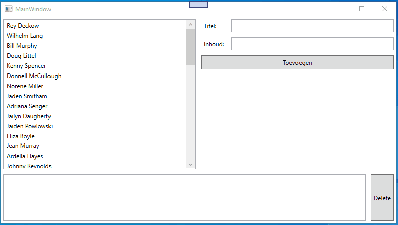

## Database klasses maken

In dit codelab gaan we vertrekken vanuit een bestaande database. Dit wil zeggen dat we reeds een database moeten hebben. Binnen de context van .NET en WPF applicaties is het logisch dat we gebruik maken van MS SqlServer DBMS.

### Visual Studio voorbereiden

We kunnen Visual Studio gebruiken om de MS SqlServer te raadplegen. Om hiervan gebruik te kunnen maken moeten we ervoor zorgen dat er bepaalde opties geïnstalleerd zijn in Visual Studio, dit kan je doen met behulp van de Visual Studio Installer.
Hierbij klik je op "Modify".

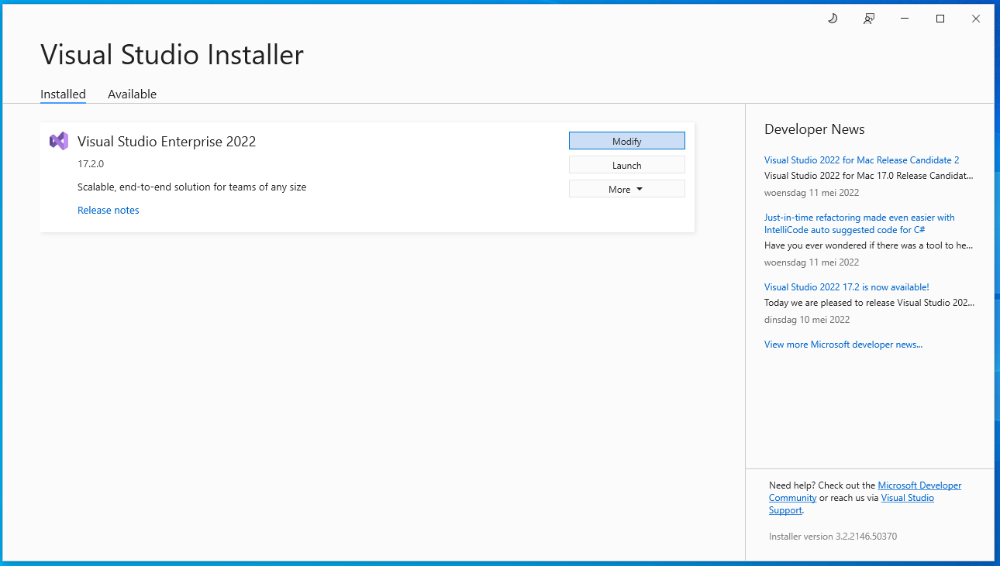

Hierna klik je op Individual components

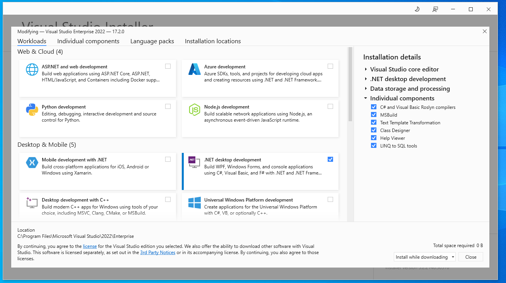

Tot slot zoek je in de lijst naar onderstaande opties en vink je deze aan. Sluit af door op Modify te klikken.
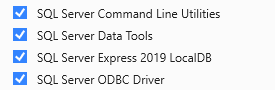

### Database inladen

Om de database kan je gebruik maken van de file messages.sql die je terug kan vinden in het project.

Open deze file en klik op de play knop in het kader waar de file geopend is.
Visual Studio vraagt nu met welke connectie we deze willen uitvoeren. Hier kies je voor local -> MSSQLLocalDB.

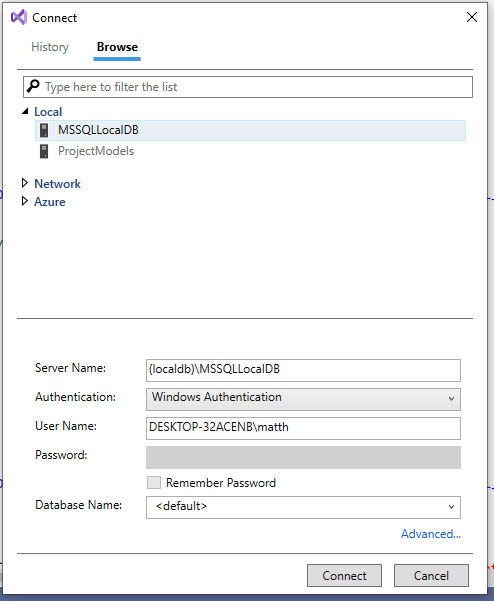

Als alles goed verlopen is, is de database goed ingeladen. Dit kan je controleren door bij view de SQL server Object Explorer te openen.


Hier kan je alle database terug vinden op de geconnecteerde servers. De MSSQLLocalDB is by default geconnecteerd. Indien je je database niet direct terug vindt, kan het helpen door te klikken op het reload icoon.

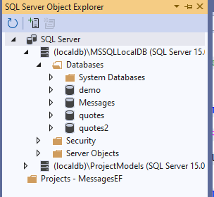

### Database klasses genereren

Om de database klasses te genereren gaan we een nieuw item toe voegen. Dit kunnen we doen door rechts te klikken op het project -> Add -> New Item ....
In het lijstje dat we hier zien, zoeken we naar ADO.NET Entity Data Model. Geef onderaan een duidelijke naam. Vervolgens kan je op Add klikken.

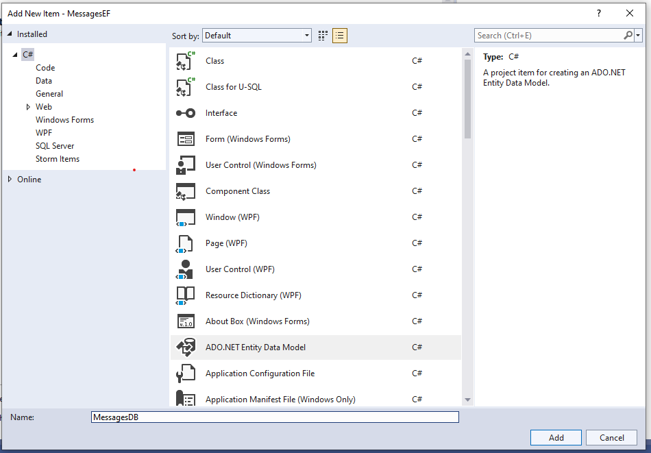

Hier hebben we enkele opties. We kiezen in dit geval voor Code First from database. Hierna klik je op Next.

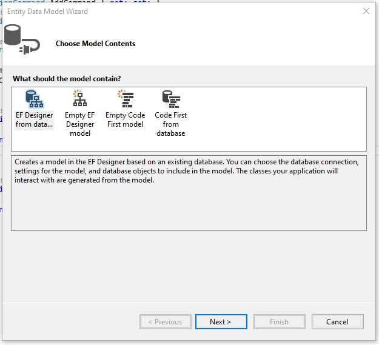

In deze stap moeten we de database connectie creëren. Klik hiervoor op New Connection... .

Hierbij moeten we de server name meegeven. In ons geval zal dit (localdb)\MSSQLLocalDB zijn. Daarna kan je onderaan de juiste database kiezen. Voor dit project is dat de database Messages. Hierna kan je op OK klikken. En klik vervolgens op Next.

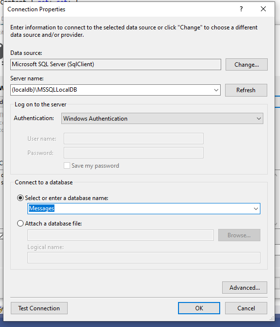

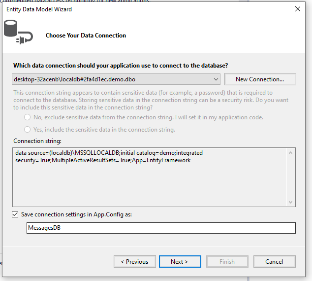

In de volgende stap moeten we aanduiden welke tabellen we in ons model willen. We kiezen er voor om alle tabellen toe te voegen. Views zijn er in de database niet aanwezig dus deze gaan we niet toevoegen. Vink de optie pluralize or singularize generated object names aan.
Tot slot klikken we op Finish.

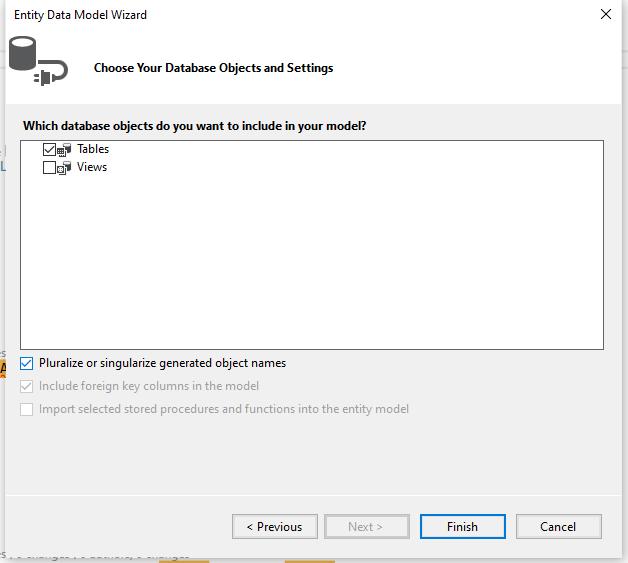

Als alles goed verlopen is zouden er nu 3 klasses toegevoegd zijn aan het project.

- MessagesDB => Dit is de klasse die ervoor gaat zorgen dat we aan onze database kunnen. In deze klasse vinden we ook 2 properties waarmee we de tabellen authors en posts kunnen bevragen.
- Posts => Dit is een dataklasse die ervoor zorgt dat we records in de posts tabel kunnen voorstellen als object.
- Authors => Dit is een dataklasse die ervoor zorgt dat we records in de authors tabel kunnen voorstellen als object.

## CRUD operaties

### Vervangen van Object klasses

Vervang waar er gebruik gemaakt wordt van een Object klasse als type, dit naar de juiste klasse (Author of Post).

### Auteurs inladen

In een volgende stap gaan we de auteurs van de posts inladen. Om dit te kunnen doen moeten we in het ViewModel een object voorzien waarbij we de database kunnen aanspreken. Dit kunnen we doen via MessagesDB.

```c#
private MessagesDB messagesDB = new MessagesDB();
```

Via dit object kunnen we alle auteurs uitlezen met behulp van de property Authors. We willen de auteurs direct zien bij opstart dus plaatsen we de code die hiervoor nodig is in de constructor van het ViewModel.

```c#
public MainViewModel()
{

    ...

    Authors = messagesDB.Authors.ToList();
}
```

Wanneer we nu de applicatie openen zien we geen mooie output. We hebben nu 2 opties om dit object mooier te laten zien.

1. We schrijven in de xaml code een itemtemplate
2. We overschrijven in de Author klasse de ToString methode zodat hier een naam wordt geprint.

In dit geval kiezen we voor de laatste optie.

```c#
// In de klasse Author
public override string ToString()
{
    return $"{First_name} {Last_name}";
}
```

### Posts inlezen

Wanneer een auteur wordt aangeklikt, willen we zijn posts uitlezen. Dit wil zeggen dat wanneer de setter van de property SelectedAuthor aangeroepen wordt dat we een functie LoadPosts gaan aanroepen.

```c#
public Author SelectedAuthor
{
    get => selectedAuthor;
    set
    {
        selectedAuthor = value;
        LoadPosts(selectedAuthor);
    }
}
```

De functie `LoadPosts` kunnen we op manieren benaderen. Hieronder bespreken we beide opties.

#### Optie 1

We kunnen er voor kiezen om de posts rechtstreeks in te laden vanuit ons auteur object.

De functie `LoadPosts` zal er dan als volgt uitzien.

```c#
private void LoadPosts(Author selectedAuthor)
{
    Posts = selectedAuthor.Posts.ToList();
}
```

Dit kunnen we doen doordat we in de klasse Author een referentie bijhouden naar een lijst van Posts.

#### Optie 2

In optie 2 gaan we vanuit de database de posts laden. Hierbij hebben we een filter nodig die er voor zorgt dat enkel de posts van een bepaalde author worden ingeladen.
Dit kunnen we doen aan de hand van LINQ. Met de methode Where kunnen we er voor zorgen dat een post van een bepaalde author moet zijn.

```c#
private void LoadPosts(Author selectedAuthor)
{
    Posts = messagesDB.Posts.Where(post => post.Author.Id == selectedAuthor.Id).ToList();
}
```

Let op in de where methode kunnen we in dit geval enkel filteren met primitive types (string, int, double, float, datetime,...). We kunnen hier niet filteren op basis van een author object. Dit komt doordat deze aanroep wordt omgezet in een SQL query.

Om de post goed te laten zien moeten we zoals bij auteurs er voor zorgen dat we een itemtemplate hebben of de ToString methode overschrijven. We kiezen hier terug voor het laatste.

```c#
public override string ToString()
{
    return Title;
}
```

### Posts Maken

Om een post te maken moet er een auteur geselecteerd zijn. Deze check gaan we nu in het commando doen. Idealiter wordt dit gedaan alvorens de methode wordt aangeroepen.
Ook hier hebben we 2 manieren om dit te doen.

#### Optie 1

De eerste manier is als een update van de geselecteerde auteur. We gaan in de posts van de auteur een nieuwe auteur toevoegen.

Op het einde mogen we niet vergeten op de dbcontext `SaveChanges` aan te roepen. Wanneer we dit niet doen, wordt de post niet opgeslagen in de database.

```c#
private void AddCommandAction()
{
    if (SelectedAuthor!= null)
    {
        Post post = new Post();
        post.Title = Title;
        post.Content = Content;
        post.Date = DateTime.Now;

        SelectedAuthor.Posts.Add(post);

        messagesDB.SaveChanges();
        LoadPosts(SelectedAuthor);

    }
}
```

#### Optie 2

Bij de tweede optie maken we een nieuwe post aan, stellen we een auteur in en slaan we de post op.

Ook hier mogen we niet vergeten om `SaveChanges` aan te roepen. Wanneer we dit niet doen, wordt de nieuwe post niet opgeslagen.

```c#
private void AddCommandAction()
{
    if (SelectedAuthor != null)
    {
        Post post = new Post();
        post.Author = SelectedAuthor;
        post.Title = Title;
        post.Content = Content;
        post.Date = DateTime.Now;

        messagesDB.Posts.Add(post);
        messagesDB.SaveChanges();
        LoadPosts(SelectedAuthor);

    }
}
```

### Posts deleten

Om een post te deleten moeten we deze uit de database halen. Hiervoor kunnen we op de property Posts van de MessagesDB klasse de methode remove aanroepen.
Ook hier moeten we er op letten dat we de `SaveChanges` methode aanroepen. Anders wordt dit niet opgeslagen in de database. Daarna herladen we de posts zodat dit ook aangepast wordt in de view.

```c#
private void DeleteCommandAction()
{
    if (SelectedPost != null)
    {
        messagesDB.Posts.Remove(SelectedPost);
        messagesDB.SaveChanges();
        LoadPosts(SelectedAuthor);
    }
}
```

Negative
: Voer dit niet uit als een wijziging op SelectedAuthor. Wanneer we bij de Author de post zouden verwijderen dan blijft de post bestaan maar is deze niet meer verbonden aan deze auteur. Dit is niet de bedoeling.

```c#
// Deze code gaat dus NIET werken.
private void DeleteCommandAction()
{
    if (SelectedPost != null)
    {
        SelectedAuthor.Posts.Remove(SelectedPost);
        messagesDB.SaveChanges();
        LoadPosts(SelectedAuthor);
    }
}
```

## DataRepositories

Op dit moment hebben we een werkende applicatie. Echter zijn we op dit moment aan het zondigen tegen 1 van de basis regels van OOP. Dat is het single responsibility principe. Een klasse zou slechts 1 verantwoordelijkheid mogen hebben. Zo is de verantwoordelijkheid van een data klasse, data bijhouden. De verantwoordelijkheid van een ViewModel is er voor zorgen dat de data klaar is om in de view te tonen. In onze huidige applicatie zorgt het viewmodel er momenteel ook voor dat de data uit de database gelezen en weggeschreven wordt. Deze verantwoordelijk gaan we uit het viewmodel halen. Behalve dat we hiermee beter de regels van OOP volgen, zorgen we er ook voor dat het viewmodel minder complex wordt en we zorgen er voor dat bepaalde delen van de code herbruikbaar worden.

Een datarepository is een klasse die er voor zorgt dat we data uit een database kunnen lezen en ernaar weg kunnen schrijven. Vaak worden in een datarepository de standaard CRUD operaties voorzien.

Positive
: CRUD operaties zijn Create, Read, Update, Delete acties.

### AuthorDataRepository

Een eerste datarepository die we gaan maken is die voor Author. Om de datarepositories niet te groot te maken, worden deze vaak opgesplitst per tabel. Dit maakt het later ook gemakkelijker om iets terug te vinden.

Ter illustratie voorzien we alle belangrijke operaties in deze repository. Wanneer je later zelf datarepositories schrijft, beperk je tot de operaties die je nodig hebt. Het heeft geen zin om code te schrijven die nooit gebruikt wordt.

```c#
internal class AuthorDataRepository
{
    MessagesDB messagesDB = new MessagesDB();

    public List<Author> GetAllAuthors()
    {
        return messagesDB.Authors.ToList();
    }

    public Author GetAuthor(int id)
    {
        return messagesDB.Authors.First(author => author.Id == id);
    }

    public void CreateAuthor(string firstname, string lastname, DateTime birthdate, DateTime addedDate, string email)
    {
        Author author = new Author();
        author.First_name = firstname;
        author.Last_name = lastname;
        author.Birthdate = birthdate;
        author.Added = addedDate;
        author.Email = email;

        messagesDB.Authors.Add(author);
        messagesDB.SaveChanges();
    }

    public void UpdateAuthor(Author author)
    {
        Author authorToUpdate = messagesDB.Authors.First(a => a.Id == author.Id);

        authorToUpdate.First_name = author.First_name;
        authorToUpdate.Last_name = author.Last_name;
        authorToUpdate.Birthdate = author.Birthdate;
        authorToUpdate.Added = author.Added;
        authorToUpdate.Email = author.Email;
        authorToUpdate.Posts = author.Posts;

        messagesDB.SaveChanges();
    }

    public void DeleteAuthor(Author author)
    {
        Author authorToDelete = messagesDB.Authors.First(a => a.Id == author.Id);

        messagesDB.Authors.Remove(authorToDelete);
        messagesDB.SaveChanges();
    }
}
```

In bovenstaande code zijn er enkele opmerkelijkheden. Wanneer we een update doen van auteur is er voor gekozen om niet alle parameters apart door te geven zoals bij create. Dit is een vrije keuze, zolang maar duidelijk is wat er bedoeld wordt. Je kan er ook voor kiezen om het auteur object bij `CreateAuthor` al aan te maken buiten deze methode om zo de parameter lijst te beperken. In principe is de manier waarop je dit doet niet heel belangrijk. Probeer wel te kiezen voor 1 manier en dit dan overal zo te doen.

Ook zien we bij `UpdateAuthor` en `DeleteAuthor` dat er eerst een object wordt gezocht op basis van het Id van het auteur object dat doorgegeven wordt als parameters. In principe is dit niet nodig maar er is wel een goede reden voor. Bij het wijzigen van bestaande data (delete of update) speelt de DBContext (in ons geval MessagesDB) een grote rol. Een object dat we uit de database halen is gekoppeld aan een DBContext. Deze DBContext heeft controle over welke objecten geupdate en/of verwijderd zijn. Dit wil zeggen dat wanneer we een auteur willen verwijderen of wijzigen die we niet verkregen hebben via de messagesDB die we aangemaakt hebben in de authorDataRepository, dat dit gaat falen. Een simpele oplossing hiervoor is op basis van de Primary key (in dit geval het ID), het object nog eens op te halen. Dit object gaan we dan gebruiken om de data te deleten of wijzigen.

### PostDataRepository

We doen nu ook hetzelfde voor de PostDataRepository. Probeer dit eens zonder al op voorhand naar de oplossing te kijken hieronder.

```c#
internal class PostDataRepository
{
    MessagesDB messagesDB = new MessagesDB();

    public List<Post> GetPosts()
    {
        return messagesDB.Posts.ToList();
    }

    public Post GetPost(int id)
    {
        return messagesDB.Posts.First(post => post.Id == id);
    }

    public List<Post> GetPostsFor(Author selectedAuthor)
    {
        return messagesDB.Posts.Where(p => p.Author_id == selectedAuthor.Id).ToList();
    }

    public void CreatePost(Author selectedAuthor, string title, string content)
    {
        Post post = new Post();
        post.Author_id = selectedAuthor.Id;
        post.Title = title;
        post.Content = content;
        post.Date = DateTime.Now;

        messagesDB.Posts.Add(post);
        messagesDB.SaveChanges();
    }

    public void UpdatePost(Post post)
    {
        Post postToUpdate = messagesDB.Posts.First(p => p.Id == post.Id);

        postToUpdate.Author_id = post.Author_id;
        postToUpdate.Date = post.Date;
        postToUpdate.Content = post.Content;
        postToUpdate.Title = post.Title;

        messagesDB.SaveChanges();
    }

    public void DeletePost(Post post)
    {
        Post postToDelete = messagesDB.Posts.First(p => p.Id == post.Id);
        messagesDB.Posts.Remove(postToDelete);
        messagesDB.SaveChanges();
    }

}
```

Ook hier valt er iets op te merken. Bij de `CreatePost` en `UpdatePost` methode, gebruiken we het `Author_id` in plaats van het author object. Dit is om dezelfde reden als hiervoor. Het Author object komt van een andere DBContext. Om deze reden heeft de DBContext het moeilijk om de juiste linken te leggen.
Om die reden kiezen we er voor om de bijhorende Id's te gebruiken.

### ViewModel aan passen

In het viewmodel gebruiken we momenteel nog de dbContext. Aangezien de datarepositories klaar zijn kunnen we nu deze gebruiken in het ViewModel.

Voeg 2 klassevariabelen toe voor de dataRepositories.

```c#
AuthorDataRepository authorDataRepository = new AuthorDataRepository();
PostDataRepository postDataRepository = new PostDataRepository();
```

#### Auteurs inladen

We kunnen nu met 1 lijn code de auteurs inladen. Vervang de vorige code om auteurs in te laden met deze lijn code.

```c#
Authors = authorDataRepository.GetAllAuthors();
```

#### Posts inladen

Om posts in te laden waren er 2 opties.
Indien je voor optie 1 koos, mag je deze code laten staan. In het geval dat je optie 2 hebt gebruikt moeten we de code veranderen zodat er gebruik gemaakt wordt van de PostDataRepository.

```c#
private void LoadPosts(Author selectedAuthor)
{
    Posts = postDataRepository.GetPostsFor(selectedAuthor);
}
```

#### Posts toevoegen

Hierbij hadden we ook 2 opties. Indien je posts wil toevoegen op door middel van een update op het author object. Dan kan je onderstaande code gebruiken.

```c#
private void AddCommandAction()
{
    if (SelectedAuthor != null)
    {

        Post post = new Post();
        post.Content = Content;
        post.Date = DateTime.Now;
        post.Title = Title;

        SelectedAuthor.Posts.Add(post);

        authorDataRepository.UpdateAuthor(SelectedAuthor);

        LoadPosts(SelectedAuthor);

    }
}
```

De andere manier was door een nieuwe post te maken en deze toe te voegen aan de database.

```c#
private void AddCommandAction()
{
    if (SelectedAuthor != null)
    {

        postDataRepository.CreatePost(SelectedAuthor, Title, Content);
        LoadPosts(SelectedAuthor);

    }
}
```

#### Posts deleten

Een post deleten moet sowieso via de `postDataRepository`. Hiervoor kan je onderstaande code gebruiken.

```c#
private void DeleteCommandAction()
{
    if (SelectedPost != null)
    {
        postDataRepository.DeletePost(SelectedPost);
        LoadPosts(SelectedAuthor);
    }
}
```

## Conclusie

Ondertussen is je eerste database applicatie klaar en werkende. Hieronder vind je de belangrijkste zaken over EntityFramework vanuit een DB first approach.

1. We kunnen onze DB structuur automatisch omzetten naar een klasse structuur
2. Via DBContext kunnen we aan de verschillende tabellen in de database.
3. Elk record wordt voorgesteld door een object van hetzelfde type.
4. Datarepositories zorgen ervoor dat we op een propere manier in het ViewModel onze data kunnen opvragen of wijzigen.
5. Elke wijziging aan database objecten moet door een SaveChanges gevolgd worden, anders zijn de wijzigingen niet aanwezig in de database.

Positive
: Een oplossing voor dit codelab kan je [hier](https://github.com/OdiseePTT/MessagesEF/tree/Oplossing) vinden.
