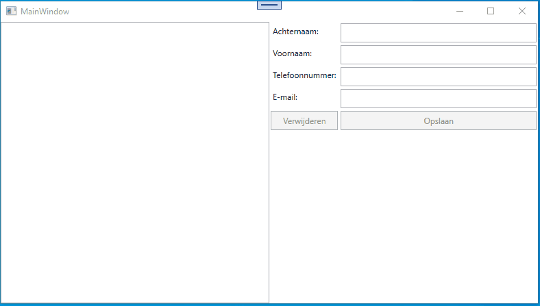

author: Matthias Druwé
summary: Telefoonboek met MVVM
id: telefoonboek-met-MVVM
categories: dotNet
tags: ptt
environments: dotNet
status: Draft
feedback link: mailto:matthias.druwe@gmail.com?subject=Problems with: telefoonboek-met-MVVM

# TelefoonBoek met MVVM

## Introductie

In dit codelab maken we een digitaal telefoonboek. In dit codelab gaan we er vanuit dat je reeds weet hoe een ViewModel werkt en wordt er dieper op de Model klasse in gegaan. Daarnaast zal je ook ontdekken hoe we op een eenvoudige manier lijsten kunnen tonen op het scherm.

### Opgave

Vul de applicatie aan zodat het mogelijk is een telefoonboek aan te maken. In de applicatie moet het mogelijk zijn personen toe te voegen. Deze personen moeten minstens een telefoonnummer of e-mail adres hebben. Wanneer personen toegevoegd zijn moeten deze zichtbaar zijn in een lijst. Wanneer een persoon in de lijst is geselecteerd kunnen we aan de hand van reeds bestaande velden, de gegevens van dit item aanpassen of zelfs verwijderen.

### Start repo

Voor deze oefening kan je de startcode vinden op [github](https://github.com/OdiseePTT/Telefoonboek).

#### Inhoud

In de startrepo kan je reeds een XAML file met een lay-out terug vinden. In deze lay-out vind je links een listbox. Rechts vinden we 4 labels met bijhorende textboxen. Onderaan de invoervelden staat er een opslaan knop die gebruikt zal worden om de items op te slaan.
Daarnaast is er ook reeds een ViewModel klasse aanwezig. Hier zit niets in en moet je zelf nog aanvullen.
Tot slot is ook de ActionCommand klasse toegevoegd. Deze kan je gebruiken om je commands te definiëren

Positive
: Check zelf zeker alle aanwezig code of je alles begrijpt. Indien niet vraag het aan de docent!

## Demo

Hieronder een demo van de afgewerkte applicatie.



## Implementeren ViewModel

Voorzie zelf de nodige properties en commands voor de textboxen en de buttons. Zorg ook dat de juiste bindings gelegd zijn.
De implementaties voor de methodes die aan de commands gekoppeld zijn hoef je nog niet te voorzien.

Negative
: Hieronder kan je de implementatie vinden. Probeer deze eerst zelf te vinden. Indien je niet weet hoe hier aan te beginnen kan je steeds terugvallen op het codelab om de bmi te berekenen.

```c#
using System.ComponentModel;
using System.Runtime.CompilerServices;
using System.Windows.Input;

namespace Telefoonboek
{
    internal class MainViewModel: INotifyPropertyChanged
    {

        public event PropertyChangedEventHandler PropertyChanged;

        private string lastname;
        private string firstname;
        private string email;
        private string phoneNumber;

        public string Lastname
        {
            get { return lastname; }
            set
            {
                lastname = value;
                OnPropertyChanged();
            }
        }

        public string Firstname
        {
            get { return firstname; }
            set
            {
                firstname = value;
                OnPropertyChanged();
            }
        }

        public string Email
        {
            get { return email; }
            set
            {
                email = value;
                OnPropertyChanged();
            }
        }

        public string PhoneNumber
        {
            get { return phoneNumber; }
            set
            {
                phoneNumber = value;
                OnPropertyChanged();
            }
        }

        public ICommand SaveCommand { get; set; }
        public ICommand DeleteCommand { get; set; }

        public MainViewModel()
        {
            SaveCommand = new ActionCommand(SaveCommandAction);
            DeleteCommand = new ActionCommand(DeleteCommandAction);
        }

        private void SaveCommandAction()
        {

        }

        private void DeleteCommandAction()
        {

        }

        private void OnPropertyChanged([CallerMemberName] string propertyName = null)
        {
            if(PropertyChanged != null)
            {
                PropertyChanged(this, new PropertyChangedEventArgs(propertyName));
            }
        }
    }
}
```

```xml
<Window x:Class="Telefoonboek.MainWindow"
        xmlns="http://schemas.microsoft.com/winfx/2006/xaml/presentation"
        xmlns:x="http://schemas.microsoft.com/winfx/2006/xaml"
        xmlns:d="http://schemas.microsoft.com/expression/blend/2008"
        xmlns:mc="http://schemas.openxmlformats.org/markup-compatibility/2006"
        xmlns:local="clr-namespace:Telefoonboek"
        mc:Ignorable="d"
        Title="MainWindow" Height="450" Width="800">
    <Window.DataContext>
        <local:MainViewModel/>
    </Window.DataContext>

    <Window.Resources>
        <Style TargetType="{x:Type Button}">
            <Setter Property="Margin" Value="2"/>
            <Setter Property="Padding" Value="5"/>
        </Style>
        <Style TargetType="{x:Type TextBox}">
            <Setter Property="Margin" Value="2"/>
            <Setter Property="Padding" Value="5"/>
        </Style>
        <Style TargetType="{x:Type ListBox}">
            <Setter Property="Margin" Value="2"/>
            <Setter Property="Padding" Value="5"/>
        </Style>
    </Window.Resources>
    <Grid>
        <Grid.ColumnDefinitions>
            <ColumnDefinition Width="*"/>
            <ColumnDefinition Width="*"/>
        </Grid.ColumnDefinitions>

        <ListBox>
        </ListBox>

        <Grid Grid.Column="1">
            <Grid.ColumnDefinitions>
                <ColumnDefinition Width="auto"/>
                <ColumnDefinition Width="*"/>
            </Grid.ColumnDefinitions>

            <Grid.RowDefinitions>
                <RowDefinition Height="auto"/>
                <RowDefinition Height="auto"/>
                <RowDefinition Height="auto"/>
                <RowDefinition Height="auto"/>
                <RowDefinition Height="auto"/>
            </Grid.RowDefinitions>

            <Label Content="Achteraam:"/>
            <Label Content="Voornaam:"  Grid.Row="1"/>
            <Label Content="Telefoonnummer:"  Grid.Row="2"/>
            <Label Content="Email:" Grid.Row="3"/>
            <Button Content="Verwijderen" Grid.Row="4" Command="{Binding DeleteCommand}"/>
            <Button Content="Opslaan" Grid.Row="4" Grid.Column="1" Command="{Binding SaveCommand}"/>

            <TextBox Grid.Row="0" Grid.Column="1" Text="{Binding Lastname}" />
            <TextBox Grid.Row="1" Grid.Column="1" Text="{Binding Firstname}"/>
            <TextBox Grid.Row="2" Grid.Column="1" Text="{Binding PhoneNumber}"/>
            <TextBox Grid.Row="3" Grid.Column="1" Text="{Binding Email}"/>
        </Grid>

    </Grid>
</Window>
```

## Model

In de volgende stap gaan we gebruik maken van een model. Een model is in principe niet meer dan een data klasse.
We voorzien een data klasse met 4 properties (voornaam, achternaam, e-mail en telefoonnummer) en een constructor waarbij 4 parameters meegegeven worden om de properties in te stellen.

```c#
namespace Telefoonboek
{
    internal class PhoneBookItem
    {
        private string lastname;
        private string firstname;
        private string email;
        private string phoneNumber;

        public string Lastname
        {
            get { return lastname; }
            set { lastname = value; }
        }
        public string Firstname
        {
            get { return firstname; }
            set { firstname = value; }
        }

        public string Email
        {
            get { return email; }
            set { email = value; }
        }

        public string PhoneNumber
        {
            get { return phoneNumber; }
            set { phoneNumber = value; }
        }

        public PhoneBookItem(string lastname, string firstname, string email, string phoneNumber)
        {
            Lastname = lastname;
            Firstname = firstname;
            Email = email;
            PhoneNumber = phoneNumber;
        }
    }
}
```

## Viewmodel uitbreiden

In een volgende stap gaan we het viewmodel verder uitbreiden zodat dit gebruik kan maken van het model.

### ObservableCollection

Om een lijst van items bij te houden zouden we kunnen kiezen om een List in het ViewModel bij te houden. Door gebruik te maken van een klassieke lijst, is het iets complexer om de view in te lichten dat er wijzigingen zijn. Hiervoor is er een speciale lijst voorzien die we kunnen gebruiken. Namelijk de klasse ObservableCollection. Deze werkt heel gelijkaardig aan een gewone lijst. Het extra voordeel dat deze lijst geeft is, dat wanneer de lijst wijzigt, de view automatisch wordt ingelicht. We hoeven dus geen `PropertyChanged` event te triggeren.

Voeg aan je viewmodel een extra property PhoneBookItems toe.

```c#
using System.Collections.ObjectModel;
using System.ComponentModel;
using System.Runtime.CompilerServices;
using System.Windows.Input;

namespace Telefoonboek
{
    internal class MainViewModel: INotifyPropertyChanged
    {

        ...

        private ObservableCollection<PhoneBookItem> phoneBookItems =  new ObservableCollection<PhoneBookItem>(); // Waarom moet hier de initialisatie al gebeuren?

        public ObservableCollection<PhoneBookItem> PhoneBookItems { get => phoneBookItems; set => phoneBookItems = value; }

       ...
    }
}

```

In de view moeten we ook deze property binden. Dit kunnen we doen in de listbox met het attribuut itemsource.

```xml
<ListBox ItemsSource="{Binding PhoneBookItems}">
</ListBox>
```

### Items toevoegen aan PhoneBookItems

Schrijf in de methode `SaveCommandAction` zelf de code die nodig is om een object van de klasse PhoneBookItem toe te voegen aan de lijst PhoneBookItems. Maak hierbij gebruik van de properties die gebonden zijn aan de textboxen. Nadat een item aangemaakt is willen we er ook voor zorgen dat de textboxen leeg gemaakt worden. Doe dit aan de hand van een methode, zodat we deze later opnieuw kunnen gebruiken.

```c#
private void SaveCommandAction()
{
    PhoneBookItems.Add(new PhoneBookItem(Lastname, Firstname, Email, PhoneNumber));
    ResetProperties();
}

private void ResetProperties()
{
    Lastname = null;
    Firstname = null;
    Email = null;
    PhoneNumber = null;
}
```

### Items Selecteren

Items selecteren konden we vroeger (wanneer we gebruik maakten van de code-behind) doen aan de hand van een events. Logischerwijs zoeken we hiervoor nu dus naar een command. Wanneer we dit proberen merken we dat ListBoxen geen command property hebben. We moeten dit dus op een andere manier proberen. De juiste manier om dit te doen is gebruik te maken van de property SelectedItem in de ListBox. Aan de hand van een property in het ViewModel kunnen we dan te weten komen dat er een item is geselecteerd.

Wanneer we een item selecteren, willen we dat de gegevens van dit item in de textboxen verschijnen. In de setter van deze property kunnen we een methode aanroepen die hiervoor zorgt.

```c#
private PhoneBookItem selectedItem;

public PhoneBookItem SelectedItem
{
    get { return selectedItem; }
    set
    {
        selectedItem = value;
        FillTextBoxes(selectedItem);
        OnPropertyChanged();
    }
}

private void FillTextBoxes(PhoneBookItem item)
{
    Lastname = item.Lastname;
    Firstname = item.Firstname;
    Email = item.Email;
    PhoneNumber = item.PhoneNumber;
}

```

Deze code bevat nog een bug. Wanneer we een item deselecteren (ctrl+click) dan crashed de applicatie. Om dit te voorkomen moeten we valideren of het geselecteerde item niet null is. Indien dit item null is, willen we alle velden leeg maken. We gaan deze check uitvoeren in de setter van de property.

```c#
public PhoneBookItem SelectedItem
{
    get { return selectedItem; }
    set
    {
        selectedItem = value;
        if (selectedItem != null)
        {
            FillTextBoxes(selectedItem);
        }
        else
        {
            ResetProperties();
        }
        OnPropertyChanged();
    }
}
```

### Items verwijderen van PhoneBookItems

Items verwijderen is op dit moment niet heel moeilijk. We hebben reeds het geselecteerde item. Wanneer er dan op verwijderen wordt geklikt, zorgen we ervoor dat dit item uit de lijst verwijderd wordt.

```c#
private void DeleteCommandAction()
{
    PhoneBookItems.Remove(SelectedItem);
}
```

### Items aanpassen

Om items aan te passen gaan we gebruik maken van de bestaande controls. Wanneer een item geselecteerd is en we drukken op opslaan, moet er dus geen nieuw item aangemaakt worden maar gaan we het bestaande item aanpassen. Bij deze actie gaan we ook automatisch het geselecteerde item deselecteren.

```c#
private void SaveCommandAction()
{
    if(SelectedItem == null)
    {
        PhoneBookItems.Add(new PhoneBookItem(Lastname, Firstname, Email, PhoneNumber));
        ResetProperties();
    } else
    {
        SelectedItem.Lastname = Lastname;
        SelectedItem.Firstname = Firstname;
        SelectedItem.Email = Email;
        SelectedItem.PhoneNumber = PhoneNumber;

        SelectedItem = null; // deselecteren van item.
    }
}
```

Op dit moment zijn alle functionaliteiten actief. In de volgende stappen gaan we er nog voor zorgen dat de lijst van gegevens proper wordt getoond en zullen we ook nog voor extra validatie zorgen.

## Custom Listitems tonen in de view

Momenteel zien we een string die verwijst naar een object in de listbox staan. Properder zou zijn dat hier iets betekenisvol zou staan. Dit kunnen we doen aan de hand van een ItemTemplate. Een ItemTemplate zorgt ervoor dat alle items volgens een bepaald formaat getoond worden.

Binnen het ItemTemplate hebben we een DataTemplate nodig waarin we een nieuwe layout kunnen maken. Met behulp van bindings kunnen we zo de gewenste properties van een phoneBookItem tonen.

```c#
<ListBox ItemsSource="{Binding PhoneBookItems}" SelectedItem="{Binding SelectedItem}">
    <ListBox.ItemTemplate>
        <DataTemplate>
            <Grid>
                <Grid.RowDefinitions>
                    <RowDefinition Height="auto"/>
                    <RowDefinition Height="auto"/>
                </Grid.RowDefinitions>
                <Grid.ColumnDefinitions>
                    <ColumnDefinition Width="*"/>
                    <ColumnDefinition Width="*"/>
                </Grid.ColumnDefinitions>
                <Label Content="{Binding Firstname}" Grid.Row="0" Grid.Column="0"/>
                <Label Content="{Binding Lastname}" Grid.Row="0" Grid.Column="1"/>
                <Label Content="{Binding Email}" Grid.Row="1" Grid.Column="0"/>
                <Label Content="{Binding PhoneNumber}" Grid.Row="1" Grid.Column="1"/>
            </Grid>
        </DataTemplate>
    </ListBox.ItemTemplate>
</ListBox>
```

Met bovenstaande code ziet de listbox er al een stuk beter uit. Wat in dit geval niet werkt is dat wanneer we een item update, dit ook in de listbox geüpdatet wordt. Dit is een probleem gerelateerd aan notifications van het ViewModel. In dit geval kunnen we dit echter niet regelen vanuit de viewModel. De Properties die we tonen zijn properties uit een model. In het Model gaan we dus ook gebruik moeten maken van de INotifyPropertyChanged interface. Dit werkt op exact dezelfde manier als in he ViewModel. Probeer dit eerst zelf alvorens de code over te nemen.

```c#
using System.ComponentModel;
using System.Runtime.CompilerServices;

namespace Telefoonboek
{
    internal class PhoneBookItem : INotifyPropertyChanged
    {
        private string lastname;
        private string firstname;
        private string email;
        private string phoneNumber;

        public event PropertyChangedEventHandler PropertyChanged;

        public string Lastname
        {
            get { return lastname; }
            set
            {
                lastname = value;
                OnPropertyChanged();
            }
        }
        public string Firstname
        {
            get { return firstname; }
            set
            {
                firstname = value;
                OnPropertyChanged();
            }
        }

        public string Email
        {
            get { return email; }
            set
            {
                email = value;
                OnPropertyChanged();
            }
        }

        public string PhoneNumber
        {
            get { return phoneNumber; }
            set
            {
                phoneNumber = value;
                OnPropertyChanged();
            }
        }

        public PhoneBookItem(string lastname, string firstname, string email, string phoneNumber)
        {
            Lastname = lastname;
            Firstname = firstname;
            Email = email;
            PhoneNumber = phoneNumber;
        }

        private void OnPropertyChanged([CallerMemberName] string property = null)
        {
            if (PropertyChanged != null)
            {
                PropertyChanged(this, new PropertyChangedEventArgs(property));
            }
        }
    }
}
```

## Validatie toevoegen

Tot slot willen we ook nog validatie. We willen namelijk geen lege items opslaan of items verwijderen die niet geselecteerd zijn. We kunnen dit checken wanneer we de actie doen maar beter is de acties niet toe te laten wanneer we dit niet willen.

In dit geval gaan we dus de buttons enablen of disablen. Hiervoor moeten we twee nieuwe properties maken en moeten we deze koppelen aan de isEnabled property van de buttons.

```c#
private bool saveButtonEnabled;
private bool deleteButtonEnabled;

public bool SaveButtonEnabled
{
    get { return saveButtonEnabled; }
    private set
    {
        saveButtonEnabled = value;
        OnPropertyChanged();
    }
}

public bool DeleteButtonEnabled
{
    get { return deleteButtonEnabled; }
    private set
    {
        deleteButtonEnabled = value;
        OnPropertyChanged();
    }
}

```

```xml
<Button Content="Verwijderen" Grid.Row="4" Command="{Binding DeleteCommand}" IsEnabled="{Binding DeleteButtonEnabled}"/>
<Button Content="Opslaan" Grid.Row="4" Grid.Column="1" Command="{Binding SaveCommand}" IsEnabled="{Binding SaveButtonEnabled}"/>
```

Met bovenstaande code wordt er nog niets gevalideerd. Wel worden de juiste bindings gelegd.

De opslaan knop mag enabled zijn wanneer er een voornaam, achternaam en e-mail adres of telefoonnummer is ingevuld. Telkens als 1 van deze properties gewijzigd wordt moet dit dus gevalideerd worden en moet de knop eventueel aangepast worden.

De functie die helpt voor de validatie is onderstaande. Vergeet deze niet aan te roepen in de juiste setters.

```c#
private void CheckSaveButtonAvailablity()
{
   SaveButtonEnabled = (Lastname != null && Lastname != "") && (Firstname != null && Firstname != "") && ((Email != null && Email != "") || (PhoneNumber != null && PhoneNumber != ""));
}
```

We merken wel nog dat de validatie niet onmiddellijk gebeurt. Dit is normaal aangezien de property pas ingesteld wordt wanneer de focus van het veld veranderd. Er zijn manieren om dit instant te doen maar deze vallen buiten deze cursus.

Tot slot moeten we nog iets gelijkaardigs doen voor de verwijder knop. De verwijderknop mag enkel bruikbaar zijn bij, wanneer er een item is geselecteerd. Met andere woorden wanneer SelectedItem niet null is mag de knop enabled zijn. Hieronder vind je de methode die ons hierbij helpt. Zorg er zelf voor dat deze op de juiste plaats wordt aangeroepen.

```c#
private void CheckDeleteButtonAvailablity()
{
    DeleteButtonEnabled = SelectedItem != null;
}
```

Normaal zou de applicatie nu klaar moeten zijn volgens de gevraagde requirements.

## Conclusie

We hebben de MVVM architectuur wat verder bekeken. De belangrijkste zaken die we tegen kwamen zijn:

1. Het Model is meestal een simpele data klasse.
2. We kunnen het model gebruiken in een listbox. Hier mogen we niet vergeten de INotifyPropertyChanged interface te implementeren wanneer dit nodig is.
3. Met een ObservableCollection kunnen we eenvoudig een list tonen in een ListBox.
4. We kunnen in een ViewModel geen selectionChanged event opvangen, wel kunnen we gebruik maken van een SelectedItem property.
5. Met ItemTemplate en DataTemplate kunnen we ListBoxItems custom views geven.

Positive
: Een oplossing voor dit codelab kan je [hier](https://github.com/OdiseePTT/Telefoonboek/tree/oplossing) vinden.
