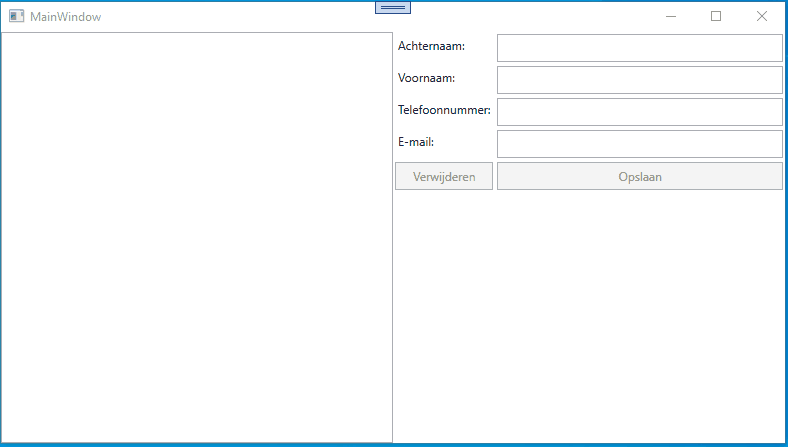
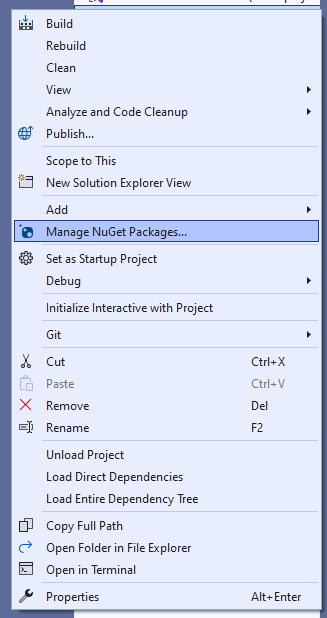
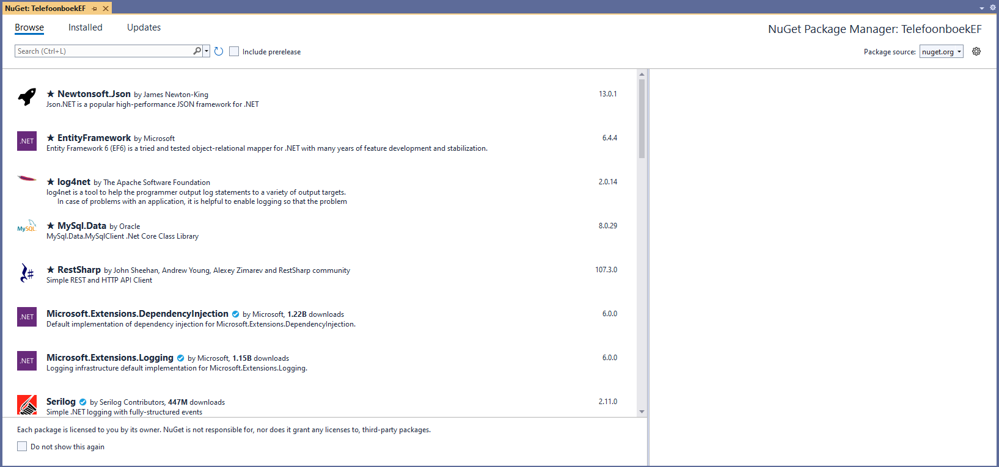
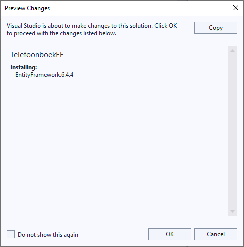
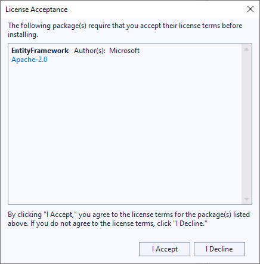

author: Matthias Druwé
summary: Telefoonboek met EF
id: telefoonboek-met-EF
categories: dotNet
tags: ptt
environments: dotNet
status: Draft
feedback link: mailto:matthias.druwe@gmail.com?subject=Problems with: telefoonboek-met-EF

# TelefoonBoek met EF

## Introductie

In dit codelab maken we een uitbreiding op het telefoonboek dat we in een vorig codelab maakte. Waar er vorige keer nog geen behoud van data was, gaan we er nu wel voor zorgen dat de data die we invoegen niet verloren gaat.

### Opgave

Vul de applicatie aan zodat het mogelijk is een telefoonboek aan te maken en op te slaan in de database.

### Start repo

Voor deze oefening kan je de startcode vinden op [github](https://github.com/OdiseePTT/TelefoonboekEF). Of verder werken op je eigen applicatie uit het vorige codelab.

#### Inhoud

Positive
: Check zelf zeker alle aanwezig code of je alles begrijpt. Indien niet vraag het aan de docent!

## Demo

Hieronder een demo van de afgewerkte applicatie.



## Voorbereidingen om entity framework te gebruiken

### NuGet Packages

Voor we starten aan onze applicatie moeten we ervoor zorgen dat de juiste packages aanwezig zijn. We zoeken naar de EntityFramework packages. Dit kan je doen met behulp van de onderstaande stappen.

Rechtsklik op de project en kies daar voor "Manage NuGet Packages...".



Zoek vervolgens in de browse tab naar EntityFramework. Je zal hier verschillende opties vinden. Kies zeker de juiste versie. Dit is EntityFramework 6.



Selecteer deze versie en klik op "Install". Hierna krijg je twee meldingen waar achtereenvolgens op "OK" en op "I Accept" moeten klikken.




Wanneer dit gelukt is zien we in ons project onder references dat EntityFramework en EntityFramework.SqlServer voorzien zijn.

### ConnectionString

Om de applicatie te verbinden met een database. Hebben we een ConnectionString nodig. Een ConnectionString verteld aan de applicatie hoe we met een database (dbms) moeten connecteren.

```xml
"Data source=(localdb)\MSSQLLOCALDB;initial catalog=phonebook"
```

De connection string die we gaan gebruiken bestaat uit 2 onderdelen.

1. Data source => dit is een verwijzing naar waar de database staat. In ons geval is dat gewoon op onze lokale machine
2. Initial catalog => dit geeft aan hoe onze database zal noemen.

Dit moeten we instellen in de file `App.Config`.

```xml
<configuration>
  ...
	<connectionStrings>
		<add name="phonebook" connectionString="Data source=(localdb)\MSSQLLOCALDB;initial catalog=phonebook" providerName="System.Data.SqlClient"/>
	</connectionStrings>
</configuration>
```

We voegen een item connectionStrings toe. Waaronder we verschillende strings kunnen toevoegen.
Elk item bestaat uit een naam, de connectionstring en de providername.

De name is een verwijzing die we later kunnen gebruiken om de correcte connectionstring in te laden.

De providername geeft mee wat voor type database entity framework moet gebruiken. Binnen onze context zal dit steeds `System.Data.SqlClient` zijn.

## DbContext

Om met de database te kunnen communiceren, moet er een DbContext aanwezig zijn. Maak hiervoor een nieuwe klasse die je `PhoneBookDB` noemt. Deze klasse laat je overerven van `DbContext`.

```c#
using System.Data.Entity;

namespace Telefoonboek
{
    internal class PhoneBookDB : DbContext
    {
    }
}

```

### Constructor

We voegen een constructor toe. Het doel van deze constructor is vooral er voor zorgen dat de juiste connectionstring gebruikt wordt. Dit kunnen we meegeven doormiddel van de baseconstructor aan te spreken.

```c#
public PhoneBookDB() : base("phonebook") // phonebook is de naam die we aan de connectionstring gaven.
{

}
```

### Properties

Door middel van properties van het type DbSet kunnen we een tabel aanspreken van de database.
We voorzien dus een property items van het type `DbSet<PhoneBookItems>`.

```c#
public virtual DbSet<PhoneBookItem> Items { get; set; }
```

## Model

In ons model moeten we enkele zaken aanpassen. Bij EntityFramework zijn er 2 dingen belangrijk bij het model.

1. We hebben een default constructor nodig. Dit wil zeggen dat wanneer we een geparametriseerde constructor hebben, we de default constructor zelf moeten aanvullen.
2. We hebben een veld/property nodig die kan fungeren als primary key.

### Default constructor

In het model `PhoneBookItem` voegen we een extra constructor toe.

```c#
public PhoneBookItem()
{

}
```

### Primary key property

We gaan aan de PhoneBookItem klasse een extra property toevoegen `Id`. Voor deze property plaatsen we een data annotation, waarmee we duidelijk maken dat deze property de primary key is.

```c#
[Key]
public int ID { get; set; }
```

### Data annotations

We kunnen indien gewenst nog extra data annotations toevoegen. Met deze annotations kunnen we het Entity Framework meer info geven over bepaalde wensen die we hebben.

De belangrijkste annotations zijn:

- `[NotMapped]` => Deze property komt niet in de database voor
- `[Column("blog_id")]`=> Wanneer een veld in de database een andere naam heeft dan de property in de klasse
- `[Column(TypeName = "varchar(200)")]` => Wanneer we een veld in de database een specifiek type willen geven.
- `[Required]` => Een verplicht veld in de database.

## Repository class

We plaatsen alle code om de database aan te passen in een repository class zodat we de code in ons viewModel niet onnodig vervuilen met code om de database aan te spreken. We willen dat dit simpel gebeurd.

Normaliter schrijven we de repository klasse in functie van wat we nodig hebben. In dit geval maken we ze in 1 keer. We weten dat onderstaande acties nodig zijn.

- Uitlezen van data
- Data opslaan
- Items updaten
- Item Deleten

Maak een nieuwe klasse die je `PhoneBookRepository` noemt. Voorzie hier al een object phonebook dat van het Type PhoneBookDB is.

```c#
using System.Collections.Generic;
using System.Linq;

namespace Telefoonboek
{
    internal class PhoneBookRepository
    {
        PhoneBookDB phoneBook = new PhoneBookDB();
    }
}
```

### Uitlezen van data

Bij het uitlezen van het telefoonboek. Verwachten we van de methode een lijst van `TelefoonBookItems`. Dit kunnen we doen door de items op te vragen via `PhoneBookDB`, die we dan via linq omzetten naar een list.

```c#
internal List<PhoneBookItem> GetAllPhoneBookItems()
{
		return phoneBook.Items.ToList();
}
```

### Data opslaan

Om data op te slaan moeten we een item toevoegen aan de Items property van `PhoneBookDB`. In dit geval is er voor gekozen om direct het item door te sturen en niet te werken via parameters. Wat we bij updates aan de database niet mogen vergeten is de aanroep naar `SaveChanges`.

```c#
internal void SaveItem(PhoneBookItem item)
{
		phoneBook.Items.Add(item);
		phoneBook.SaveChanges();
}
```

### Items updaten

Een item update kunnen we in principe eenvoudig doen, door het item aan te passen en SaveChanges aan te roepen. In bepaalde gevallen, wanneer een item afkomstig is van een andere PhoneBookDB instantie, lukt dit niet. Hiervoor is er hieronder gekozen om het item aan de hand van het ID terug op te vragen en op dit item de aanpassingen uit te voeren.

```c#
internal void UpdateItem(PhoneBookItem item)
{
		PhoneBookItem itemToUpdate = phoneBook.Items.First(i => i.ID == item.ID);
		itemToUpdate.Firstname = item.Firstname;
		itemToUpdate.Lastname = item.Lastname;
		itemToUpdate.Email = item.Email;
		itemToUpdate.PhoneNumber = item.PhoneNumber;

		//Bovenstaande code is hier niet nodig.
		//Deze is er bij geplaats wanneer we ooit uitbreiding zouden doen met een 2de repository class.
		//In dat geval zou het kunnen dat de parameter item afkomstig is van een andere DbContext, waardoor de update niet mogelijk is.

		phoneBook.SaveChanges();
}
```

### Item Deleten

Een item deleten kunnen we in principe eenvoudig doen, door het item aan te uit de DBset te verwijderen met behulp van de `Remove` methode. In bepaalde gevallen, wanneer een item afkomstig is van een andere PhoneBookDB instantie, lukt dit niet. Hiervoor is er hieronder gekozen om het item aan de hand van het ID terug op te vragen en op dit item dan te verwijderen.

```c#
internal void DeleteItem(PhoneBookItem item)
{

		PhoneBookItem itemToDelete = phoneBook.Items.First(i => i.ID == item.ID);
		phoneBook.Items.Remove(itemToDelete);

		//Bovenstaande code is hier niet nodig.
		//Deze is er bij geplaats wanneer we ooit uitbreiding zouden doen met een 2de repository class.
		//In dat geval zou het kunnen dat de parameter item afkomstig is van een andere DbContext, waardoor de delete niet mogelijk is.

		phoneBook.SaveChanges();
}
```

## Aanpassingen ViewModel

In het ViewModel zijn er enkele wijzigingen die we moeten doen. We gaan enkele delen van de bestaande code moeten wijzigen en wat extra code toevoegen.

### List vs ObservableCollection

Wanneer we de data telkens opvragen via de datarepository gaan we niet rechtstreeks de data in de listbox aanpassen. Om PhoneBookItems op te slaan gaan we terug gebruik maken van een List ipv een ObservableCollection. In deze case zou dit geen meerwaarde zijn.

```c#
private List<PhoneBookItem> phoneBookItems = new List<PhoneBookItem>();

public List<PhoneBookItem> PhoneBookItems
{
		get => phoneBookItems;
		set
		{
				phoneBookItems = value;
				OnPropertyChanged();
		}
}
```

### PhoneBookRepository

Om de phoneBookRepository te gebruiken moeten we een globaal object voorzien. Maak op klasse niveau een nieuw Object phoneBookRepository.

```c#
PhoneBookRepository phoneBookRepository = new PhoneBookRepository();
```

### Data inladen

Bij de start van de applicatie of wanneer het MainWindow wordt geopend, willen we de bestaande data inlezen. Dit kan je doen in de constructor van het ViewModel. Hiervoor moeten we 1 lijn code toevoegen in de constructor die er voor zorgt dat we de data uit de database laden.

```c#
PhoneBookItems = phoneBookRepository.GetAllPhoneBookItems();
```

### Data opslaan of aanpassen

Ook in de methode `SaveCommandAction` moeten we enkele wijzigingen doen. In eerste instantie moeten we een item opslaan in de database in plaats van een nieuw item toe te voegen aan de `PhoneBookItems`.

Verder moeten we ook bij een update actie, aan de `phoneBookRepository` door geven dat er een item is geupdate.

Tot slot moet de data opnieuw uit de database ingeladen worden.

```c#
private void SaveCommandAction()
{
		if (SelectedItem == null)
		{
				phoneBookRepository.SaveItem(new PhoneBookItem(Lastname, Firstname, Email, PhoneNumber));
				ResetProperties();
		}
		else
		{
				SelectedItem.Lastname = Lastname;
				SelectedItem.Firstname = Firstname;
				SelectedItem.Email = Email;
				SelectedItem.PhoneNumber = PhoneNumber;
				phoneBookRepository.UpdateItem(SelectedItem);

				SelectedItem = null; // deselecteren van item.
		}
		PhoneBookItems = phoneBookRepository.GetAllPhoneBookItems();
}
```

### Items verwijderen

In de `DeleteActionCommand` moeten we de data uit de database verwijderen. Hiervoor gebruik je de `DeleteItem` methode van de `PhoneBookRepository`. Nadien mogen we niet vergeten de data terug in te laden uit de database.

```c#
private void DeleteCommandAction()
{
		phoneBookRepository.DeleteItem(SelectedItem);
		PhoneBookItems = phoneBookRepository.GetAllPhoneBookItems();
}
```

## Database Migraties

Een database migratie is nodig wanneer we wijzigingen doen aan ons model. Het zou kunnen dat je plots een extra veld wil in je databank, of je wil een veld juist niet meer opslaan.

Dan hebben we 2 opties:

1. De eerste optie is dat we database verwijderen en ze nadien terug automatisch laten generen. Dit is een eenvoudige oplossing, zonder veel problemen. Bij een nieuwe applicatie is dit niet zo een groot probleem. Bij een reeds bestaande applicatie kunnen we dit niet doen. We kunnen niet bij al onze eindgebruikers de database gaan verwijderen. Daarnaast is het niet zo fijn dat je hierdoor alle data, die je reeds verzameld hebt, kwijt bent.
2. Optie 2 is het schrijven of het voorzien van een database migratie. Hieronder gaan we deze optie verder bespreken in de meest eenvoudige vorm. Wanneer migraties complexer worden (bijvoorbeeld nieuwe verplichte velden toevoegen) ga je extra stappen nodig hebben.

### Migraties activeren

Om migraties toe te kunnen voegen, moeten we dit activeren in het project. Dit kunnen we doen aan de hand van een commando in de Package Manager Console. Indien dit venster niet open staat of je kan het niet terug vinden, kan je dit steeds vinden via Tools > NuGet Package Manager > Package Manager Console.

In deze console voer je het commando `Enable-Migrations` uit. Wanneer je dit gedaan hebt zal je in je solution zien dat er een map met 2 files is aangemaakt voor jou.

In de DbContext, in dit geval de `PhoneBookDB` moeten we nog een lijn toevoegen in de constructor die er voor zorgt dat de Configuration (1 van de net aangemaakte files) wordt ingeladen.

```c#
public PhoneBookDB() : base("phonebook") // phonebook is de naam die we aan de connectionstring gaven.
{
		// PhoneBookDB is de huidige klasse, Configuration is de Configuratien klasse in de Migrations folder (hiervoor ga je nog de nodige namespaces moeten toevoegen via Using).
		Database.SetInitializer(new MigrateDatabaseToLatestVersion<PhoneBookDB, Configuration>());
}
```

### Applicatie aanpassen

Om een migratie te simuleren gaan we het PhoneBookItem aanpassen met een extra veld/property adres.

Pas hiervoor de klasse PhoneBookItem aan met onderstaande wijzigingen.

```c#
private string address;

public string Address { get => address; set => address = value; }

// Pas de bestaande constructor aan naar deze constructor, maak geen extra nieuwe constructor.
public PhoneBookItem(string lastname, string firstname, string email, string phoneNumber, string address)
{
		Lastname = lastname;
		Firstname = firstname;
		Email = email;
		PhoneNumber = phoneNumber;
		Address = address;
}
```

In MainWindow.xaml gaan we een extra label met veld moeten voorzien. De code die we hiervoor wijzigen is onderstaande.

```xml
<Label Content="Achteraam:"/>
<Label Content="Voornaam:"  Grid.Row="1"/>
<Label Content="Telefoonnummer:"  Grid.Row="2"/>
<Label Content="Email:" Grid.Row="3"/>
<Label Content="Adres:" Grid.Row="4"/>

<Button Content="Verwijderen" Grid.Row="5" Command="{Binding DeleteCommand}" IsEnabled="{Binding DeleteButtonEnabled}"/>
<Button Content="Opslaan" Grid.Row="5" Grid.Column="1" Command="{Binding SaveCommand}" IsEnabled="{Binding SaveButtonEnabled}" Grid.ColumnSpan="2"/>

<TextBox Grid.Row="0" Grid.Column="1" Text="{Binding Lastname}" />
<TextBox Grid.Row="1" Grid.Column="1" Text="{Binding Firstname}"/>
<TextBox Grid.Row="2" Grid.Column="1" Text="{Binding PhoneNumber}"/>
<TextBox Grid.Row="3" Grid.Column="1" Text="{Binding Email}"/>
<TextBox Grid.Row="4" Grid.Column="1" Text="{Binding Address}"/>
```

Tot slot moeten we hiervoor ook het MainViewModel wijzigen.

In het ViewModel voegen we een extra property toe Address, dewelke we ook gaan gebruiken bij het Saven van een PhoneBookItem.

```c#
private string address;
public string Address
{
		get { return address; }
		set
		{
				address = value;
				OnPropertyChanged();
		}
}


// Onderstaande methode moet je updaten, maak geen nieuwe aan.
private void SaveCommandAction()
{
		if (SelectedItem == null)
		{
				phoneBookRepository.SaveItem(new PhoneBookItem(Lastname, Firstname, Email, PhoneNumber, Address));
				ResetProperties();
		}
		else
		{
				SelectedItem.Lastname = Lastname;
				SelectedItem.Firstname = Firstname;
				SelectedItem.Email = Email;
				SelectedItem.PhoneNumber = PhoneNumber;
				SelectedItem.Address = Address;
				phoneBookRepository.UpdateItem(SelectedItem);

				SelectedItem = null; // deselecteren van item.
		}
		PhoneBookItems = phoneBookRepository.GetAllPhoneBookItems();
}
```

### Migratie toevoegen

Als je nu de applicatie zou starten, ga je merken dat de applicatie niet meer werkt. Dit komt doordat het model niet meer matcht met de database. Er mist namelijk een veld in de database.
We moeten hier dus nog de effectieve migratie toevoegen.

Dit kunnen we doen door middel van een extra commando in Package Manager Console. Dit nieuwe commando is `add-migration addAddressToPhoneBookItem`. Hierbij is de naam addAddressToPhoneBookItem, een naam die je zelf gekozen hebt. Als dit gelukt is, zal je zien dat er in de map Migrations een extra file is aangemaakt.

Normaal zou de applicatie nu zonder problemen moeten gestart kunnen worden.

Telkens wanneer je wijzigen doet aan je model, moet je een nieuwe migratie toevoegen op deze manier. Ook wordt er dan elke keer een nieuwe file toegevoegd aan je migrations folder.

## Conclusie

We kunnen zonder veel moeite van uit een bestaande applicatie met een model een applicatie met een database maken. De belangrijkste zaken die we tegen kwamen zijn:

1. Maak je applicatie database ready door EntityFramework toe te voegen en de nodige connectionstring te voorzien
2. Voorzie een klasse die overerft van DbContext waarmee je via DbSet properties de tabellen kan beheren
3. Voorzie je model klasses van een default constructor en een veld dat als Primary key dienst kan doen. Voeg eventueel extra data annotaties toe.
4. Spreek je database in het viewModel aan via een datarepository klasse.

Positive
: Een oplossing voor dit codelab kan je [hier](https://github.com/OdiseePTT/TelefoonboekEF/tree/oplossing) vinden.
