author: Matthias Druwé
summary: Breakout maken met behulp van Phaser.js
id: breakout-phaser
tags: js, phaser
categories: javascript
environments: Web
status: Draft
feedback link: mailto:matthias.druwe@gmail.com?subject=Problems with: Breakout-phaser

# Breakout met Phaser.js


## Introductie
In deze tutorial gaan we een versie van het arcadespel Breakout maken. Dit gaan we dien met behulp van het javascript game framework [phaser](https://phaser.io). 

<video id="Cr6z3AyhRr8">

### Phaser.io
Phaser is één van de vele game frameworks die er bestaan om games te maken in javascript.

Een game framework zorgt ervoor dat we niet alle veel voorkomende logica zelf moeten schrijven. Enkele voorbeelden van wat je kan verwachten in een game framework zijn:

* Uitvoeren van animaties
* Zwaartekracht (of andere krachten)
* collision (bots) detectie
* ...

Daarnaast zorgt een (game) framework voor een structuur hoe we code moeten schrijven en structureren. De code die we zelf schrijven wordt onderdeel van het framework en wordt door het framework uitgevoerd.

Bij een game framework vinden we vaak 2 onderdelen terug in het framework: 

* Een setup functie
* Een loop functie

De setup functie wordt gebruikt om alles wat slechts 1 keer uitgevoerd moet worden in te plaatsen. Bij een game bestaat dit vooral uit het opzetten van de startpositie.

De loop functie is een functie die continu wordt uitgevoerd. In deze functie gaan we reageren op acties en zullen de spelelementen zichzelf of andere objecten beïnvloeden.

Positive
: Dit kan je eventueel herkennen wanneer je reeds geëxperimenteerd hebt met Arduino of ESP32 bordjes.


### Opbouw van het spel
In de volgende stappen gaan we het spel stelselmatig opbouwen.

Wanneer we hierboven naar de versie van atari kijken, kunnen we enkele stappen opsplitsen.

1. Een bal die botst op muren
2. Een platform (pallet) dat heen en weer kan bewogen worden
3. De ball die botst op het pallet
4. Blokken die hangen en waar tegen gebotst kan worden en verwijderd worden
5. Extra's
   * Score + levens
   * Snelheid van de bal verhogen
   * Variabele bal richting
   * Complexe blokken (meerdere keren zelfde blok raken of opties in blokken verwerken)

### Starter code
De starter code kan je vinden op [GitHub](https://github.com/MatthiasDruwe/Breakout-workshop/tree/starter). 

Door te klikken op **code** en vervolgens **download zip** kan je de map op je computer plaatsen. Vergeet de zip file zeker niet te unzippen.

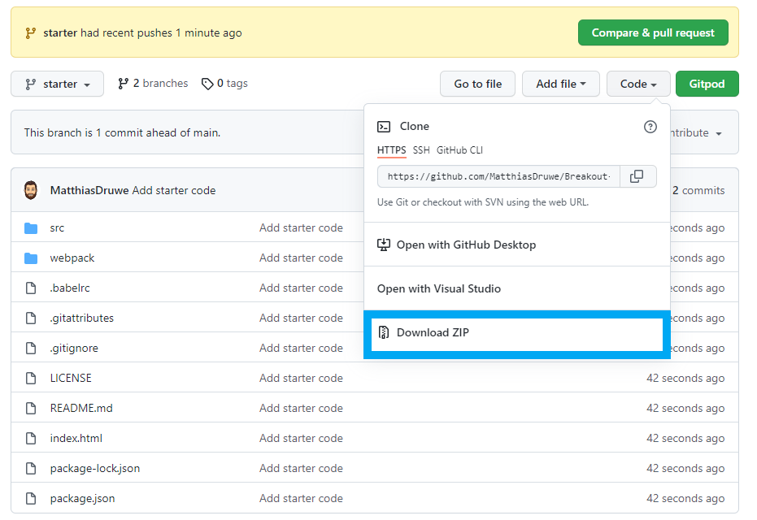

#### Dependencies
Wanneer je de gedownloade map opent met *Visual Studio Code* zie je reeds enkele mappen en bestanden staan. De meeste van deze bestanden zijn configuratie files voor Node.js.

Positive
: Node.js is een javascript runtime environment. In andere woorden wil dit zeggen dat Node.js een omgeving is waar we javascript kunnen uitvoeren (buiten de browser dus). De applicatie die we maken zal in de browser uitgevoerd worden, in dit geval gebruiken we Node.js om de juiste libraries in te laden en een development server te runnen.

Het project heeft enkele dependencies nodig die nog niet zijn toegevoegd aan het project. Deze kan je inladen met behulp van onderstaande commando. Voer dit commando uit in de terminal. De terminal kan je verkrijgen door te klikken op Terminal > New Terminal.


```console
npm install
```

Verder zijn er nog 2 commando's die we nodig gaan hebben.

Met het start commando wordt er een lokale webserver gestart. Deze gaan we nodig hebben om tijdens het ontwikkelen onze code te testen.

``` console
npm run start
```

Met het build commando wordt er een folder gemaakt die we kunnen uploaden op een webserver om ons project publiek toegankelijk te maken.

``` console
npm run build
```

#### src folder
In de src folder gaan we de applicatie maken. Hierin vind je reeds enkele assets en een index.js file waar we al onze code gaan plaatsen.

In deze file zijn er al enkele lijnen code voorzien.

Met behulp van de eerste lijn, zorgen we ervoor dat het phaser framework wordt ingeladen. De 9 import lijnen nadien, zorgen ervoor dat we op een eenvoudige manier gebruik kunnen maken van de assets.

In de codelijnen hierna wordt een class gemaakt. Deze class erft over van *Phaser.Scene*. Dit wil zeggen dat deze klasse een phaserscene gaat zijn waarin het spel zal geladen worden. Het is mogelijk om meerdere scenes te maken in 1 applicatie. In onze applicatie gaan we slechts 1 scene gebruiken.

In de Phaser.Scene class zijn 3 functies geschreven. Deze 3 functies zijn de basis van het phaser (game) framework.
* In de **preload** functie worden alle items geladen alvorens het spel gestart wordt. Deze gaan we later vooral gebruiken om images in te laden. Wanneer we images pas laden wanneer we ze nodig hebben, zou dit het spel kunnen vertragen.
* In de **create** functie gaan we het spel initialiseren. We plaatsen alle items op het scherm, voegen enkele eventlisteners toe en stellen alle startinstellingen in.
* In de **update** functie wordt alle logica geplaatst die continue moet uitgevoerd worden. In ons spel zal dit voornamelijk bestaan uit reageren op keyboardacties.

Tot slot staan er onderaan nog enkele lijnen code die dienen als configuratie. Hierin bepalen we hoe groot het canvas van de game is, welke renderer er gebruikt moet worden en welke scenes er zijn. Daarna wordt het game object met deze configuratie gemaakt. Hiermee wordt ook het spel speelbaar (zichtbaar in de browser).


## De bal laten botsen tegen de muren
In deze sectie gaan we een bal in het canvas tonen en deze laten botsen tegen de randen van het scherm.


### Preloaden van de image
De bal die we gaan gebruiken gaat de ball.png image zijn die reeds in onze imports staan. We moeten images gaan inladen en dit doen we in de `preload` functie van phaser. 

De code die we hiervoor gaan gebruiken ziet er als volgt uit.

```javascript
preload()
{
   this.load.image('ball', ball_img);
} 
```

In deze code zie je enkele zaken staan:
* **this** is een verwijzing naar de huidige klasse. Doordat we overerven van een andere klasse zijn er voor ons reeds enkele properties en functies ter beschikking
* **load** is één van de beschikbare properties. In phaser bestaan wordt deze property vooral gebruikt als een soort overkoepeling van alle load functies.
* Eén van deze load functies is **image**. Hiermee kunnen we de image reeds inladen in het geheugen van de browser. Aan deze functie geven we 2 parameters mee:
  * De eerste parameter is een string waarmee we later deze image kunnen gaan oproepen. De image krijgt een key die we later kunnen gebruiken.
  * De tweede parameter is een link naar de image. Bij ons zit deze image in een import dus kunnen we hier de importname `ball_img` gebruiken.

### Bal op het canvas plaatsen
Op dit moment is de image ingeladen, maar wordt deze nog niet op het scherm geplaatst. Hiervoor dienen we één lijn code toen te voegen aan de `create` functie van phaser.

Deze code kan je hieronder zien.

```javascript
create()
{
   this.physics.add.image(400, 300, 'ball');
}
```
Bovenstaande code is net zoals bij het preloaden van de image opgebouwd uit verschillende onderdelen.
* **this** wordt opnieuw gebruikt om de huidige klasse aan te spreken
* Nu vragen we de property **physics** die op zijn beurt een property **add** heeft. Hiermee kunnen we verschillende soorten items toevoegen op ons scherm. We zouden ook gewoon **add** kunnen gebruiken zonder **physics**. Echter willen we later gebruik maken van enkele voordelen van de ze physics, zoals het botsen tegen randen of andere images en beweging. Een gewone image heeft deze functionaliteiten niet.
* We gaan een **image** toevoegen. Deze functie heeft 3 parameters
  * De eerste parameter is de x positie waar de image geplaatst wordt.
  * De tweede parameter is de y positie. Let wel op deze posities zijn ten opzichte van het middelpunt van de image.
  * De derde parameter is de key van de image die we eerder gepreload hebben.

Hiermee zien we nog steeds niets. Dit komt doordat we gebruik maken van physics. Deze worden in phaser niet standaard ingeladen. In de game config moeten we meegeven welke physics library we gaan gebruiken. We gaan dus onderaan de file de config als volgt moeten aanpassen.

```javascript
const config = {
   ...
    physics: {
        default: 'arcade',
        arcade: {
            gravity: { 
                y: 0 
            }
        }
    }
};
```

### Bal laten bewegen
Momenteel zou je op het scherm een bal moeten zien. Helaas beweegt deze nog niet uit zichzelf.
Op de bal gaan we een velocity moeten plaatsen. Hiervoor hebben we het ball object nodig. Dit gaan we in een variabele moeten plaatsen. In javascript hebben we hiervoor 2 opties:
1. We gebruiken let `let ball = this.physics.add.image(400,300, 'ball');`. Een variabele met let is een variabele die later ook gewijzigd kan worden.
2. We gebruiken const `const ball = this.physics.add.image(400,300, 'ball');`. Een variabele met const kunnen we later niet overschrijven.

In dit geval is const de logische keuze. We kiezen voor const variabelen zolang er geen reden is om deze ooit te wijzigen.

Om snelheid aan een object toe te voegen maken we gebruik van de setVelocity functie op het object.
De code ziet er dan als volgt uit:

```javascript
create() 
{
  const ball = this.physics.add.image(400,300, 'ball');
  ball.setVelocity(100);
}
```

De parameter die we toevoegen aan de functie `setVelocity` is zowel een snelheid in de x als de y richting. 

Positive
: In de browser ligt het absolute 0-punt links boven. Dit wil zeggen dat x stijgt wanneer we van links naar rechts gaan, en y stijgt van boven naar beneden.


We merken dat nu de bal buiten ons kader komt. Dit komt doordat we nergens het scherm afgebakend hebben. Met behulp van de functie `setCollideWorldBounds` op ons ball object kunnen we dit eenvoudig aanpassen.

```javascript
create() 
{
  ...
  ball.setCollideWorldBounds(true);
}
```

Tot slot moeten we er nog voor zorgen dat de bal mooi botst. Ook hiervoor hebben we een fuctie. Dit is de `setBounce` functie.

```javascript
create() 
{
  ...
  ball.setBounce(1);
}
```

Deze functie zorgt voor een bounce zowel in y als in x richting. De parameter die we hiermee geven, geeft aan hoe hard we willen botsen. Deze waarde kan tussen 0 en 1 liggen, waarbij 0 betekent dat de bal niet botst en 1 betekent dat de bal even hard terug botst.

## Het pallet toevoegen en laten bewegen

In deze fase gaan we het pallet toevoegen aan het scherm en ervoor zorgen dat dit naar links en rechts kan bewegen.

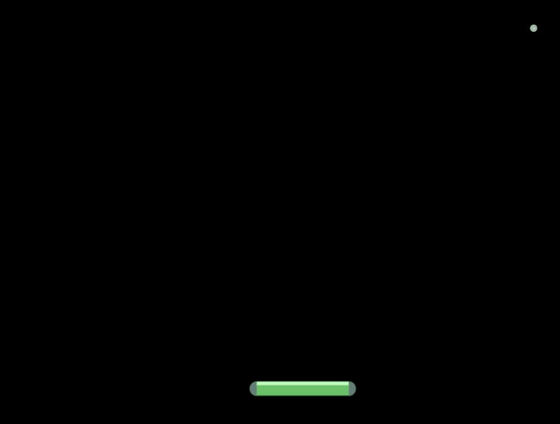

### Preloaden van de image en tonen van de image op het scherm
Net zoals bij de bal moeten we het pallet preloaden en tonen op het scherm.

Plaats zelf het pallet onderaan op het scherm. Maak hiervoor gebruik van de techniek die we in de vorige sectie zagen.

### Keyboard keys registreren
We gaan het pallet laten bewegen aan de hand van de pijltjes toetsen.

Hiervoor moeten we ons toetsenbord uitlezen. In Phaser moeten we eerst laten weten welke keys we gaan gebruiken door deze toe te voegen. We doen dit in de create fase van Phaser

```javascript

const LEFT_KEY = 'LEFT';
const RIGHT_KEY = 'RIGHT';

class MyGame extends Phaser.Scene
{

    keyboard;
    ...

    create()
    {
        ...
        this.keyboard = this.input.keyboard.addKeys(
            {
                LEFT_KEY: Phaser.Input.Keyboard.KeyCodes.LEFT, 
                RIGHT_KEY: Phaser.Input.Keyboard.KeyCodes.RIGHT
            }
          );
    }
} 
```

In bovenstaande code zien we dat we code moeten toevoegen op verschillende niveaus. Buiten de klasse maken we twee constanten aan die we later kunnen gebruiken, in plaats van hard-coded strings.

Binnen de klasse zien we een variabele keyboard. Deze keer zonder let of const. Javascript laat dit niet toe. Echter hebben we later deze variabele nodig in de update functie van de klasse. We noemen dit een **klassevariabele** of een **classmember**. In onze functies kunnen we deze aanspreken aan de hand van `this.{de variabele naam}`.

Verder zien we in de create functie dat we iets toekennen aan onze zopas gemaakte variabele `keyboard`.

Dit bestaat weer uit enkele zaken.
* Met `this` roepen we weer het huidige object aan.
* `input` is een andere property van `this`. Hierin zitten verschillende input manieren
* Met de property `keyboard` kunnen we iets gaan doen met het keyboard. In dit geval gaan we toetsen registreren met de `addKeys functie`. Deze functie krijgt één parameter mee.
  * Deze parameter is een speciale parameter want we maken hier gebruik van een javascript object dat dienst zal doen als een dictionary. Een javascipt object bestaat uit key-value paren. In dit geval is de key onze constante die we buiten de klasse gemaakt hebben en de value is een verwijzing naar de effectieve key.


### Keyboard keys controleren
De keys die we willen opvangen zijn nu geregistreerd. In de update functie kunnen we nu valideren of deze worden ingedrukt.

Dit kan je doen met onderstaande code

```javascript
update(time, delta)
{
    console.log(this.keyboard.LEFT_KEY.isDown);
}

```

De console log is een tool die ons kan helpen bij het debuggen (zoeken naar fouten) van een applicatie. In de de browser kan je de console log als volgt openen => Klik rechts in je browser scherm => Klik op inspect => Er opent nu een extra scherm,klik hier op console. Als alles goed loopt zou je hier nu false moeten zien staan. Wanneer je de linker pijl ingedrukt houdt zou je true moeten zien staan.

Schrijf zelf een selectie (if structuur) die valideert of het linker pijltje, rechter pijltje of geen enkel pijltje is ingedrukt.

### Het pallet bewegen
Nu we de input kunnen opvangen, kunnen we hier ook gepast op reageren.
* Wanneer het linker pijltje ingedrukt is, willen we naar links bewegen. 
* Wanneer het rechter pijltje ingedrukt is, willen we naar rechts bewegen
* Wanneer geen enkel pijltje ingedrukt is, willen we niet bewegen.

Het pallet kunnen we laten bewegen aan de hand van onderstaande code.

```javascript
this.paddle.setVelocityX(100);
```

In plaats van algemeen de velocity (snelheid) in te stellen, kiezen we er nu voor om enkel de X waarde aan te passen. Een negatieve velocity zorgt ervoor dat het object naar links beweegt. Een velocity van 0 zorgt ervoor dat het object blijft staan.

Let wel: Momenteel kunnen we het pallet object niet aanspreken in onze update functie. Dit komt doordat dit object enkel bestaat in de create functie. We moeten hiervan, net zoals bij keyboard, een klasse variabele van maken. Dit zal er dan als volgt uit zien.

```javascript
class MyGame extends Phaser.Scene
{
    ...
    /** @type {Phaser.Physics.Arcade.Image} */
    paddle;

    ...

    create()
    {
        ...
        this.paddle = ...
    }
}
```

In bovenstaande code zie je ook dat er commentaar is toegevoegd. Dit is een hulpmiddel voor Visual Studio Code. Javascript is een taal met dynamic typing. Dit wil zeggen dat het type van een variabele kan veranderen. Met deze lijn laten we aan de Visual Studio Code weten dat dit een arcade image is. Hier door kan VS Code ons verder helpen door de juiste intellisense opties te voorzien.

Als alles goed verloopt kan je nu op basis van je pijltjes toetsen je pallet laten bewegen. Gebruik voor de snelheid van je pallet ook eventueel constante zoals we deden voor `LEFT_KEY` en `RIGHT_KEY`.

### Pallet beperken tot ons scherm
Het pallet kan nu bewegen, maar we kunnen het pallet nog buiten de randen van ons scherm bewegen. Dit willen we niet. Bij het ball object hebben we een gelijkaardig probleem gehad en hebben we dit opgelost met 1 functie. Gebruik hier dezelfde functie.

## Collision tussen pallet en bal
De volgende stap is, er voor zorgen dat het pallet de bal doet botsen en wanneer de bal de onderkant van het scherm raakt, deze niet meer botst.


### Een collider toevoegen

Om te valideren of de bal, het pallet raakt, kunnen we beroep doen op een object dat we in onze create functie kunnen toevoegen. Dit is een collider.

```javascript
create() 
{
  ...
  this.physics.add.collider(this.paddle, ball);
  ...
}
```

Deze code is net zo opgebouwd zoals we een image willen toevoegen. Momenteel hebben we deze verder ook niet nodig, dus plaatsen we dit niet in een variabele.
De collider krijgt op dit moment 2 parameters. Dit zijn de 2 object waarvan we willen valideren of ze elkaar raken.

Positive
: Zonder een gaming framework of library moeten we zelf gaan testen of de 2 objecten elkaar raken. Hierbij moeten we valideren of de x-positie van de bal tussen de uiterste punten van het pallet ligt en de y-positie van de bal groter is dan de y-positie van het pallet. Hierbij moeten we nog rekening houden met allerhande uitzonderingen zoals wat moet er gebeuren als de bal voorbij het pallet is en toch boven de bal schuift. Nu handelt het framework deze complexiteit voor ons af.

### Het pallet blokkeren
Als je bovenstaande lijn hebt toegevoegd en dit probeert, zal je merken dat er een vreemd side-effect ontstaat. Het pallet beweegt plots naar beneden en de bal beweegt enkel nog maar in horizontale richting.
Dit is zeker _niet_ de bedoeling. We moeten er dus op een manier voor zorgen dat het pallet niet beweegbaar is door een botsing. Het zal dus niet duwbaar mogen zijn.


```javascript
create() 
{
  ...
  this.paddle.setPushable(false);
  ...
}
```

Met bovenstaande code zeggen we dat paddle object (het pallet) niet pushable mag zijn.

### Onderkant van het scherm niet botsbaar maken
Tot slot willen we ook de bal onderaan het scherm niet meer laten botsen. Later zullen we implementeren dat het spel dan moet stoppen. 


```javascript
create() 
{
  ...
  this.physics.world.checkCollision.down = false;
  ...
}
```
In bovenstaande code stellen we in dat de collision (botsing) met de onderkant van de wereld niet meer moet gevalideerd worden.

## Blokken plaatsen en laten verdwijnen
In deze stap willen we een reeks blokken op het scherm tonen die we dan door een botsing met de bal laten verdwijnen.


### Images preloaden
Alvorens we starten moeten de juiste images in de `preload` functie ingeladen worden. Doe dit net zoals het pallet en de bal.

### 1 blok toevoegen
We gaan starten met het toevoegen van 1 blok. Hierna gaan we een functie schrijven die meerdere blokken op ons scherm kan plaatsen. Aangezien we weten dat we later meerdere blokken gaan toevoegen, gaan we deze code ook al in een functie plaatsen.

```javascript
create() 
{
  ...
  this.addBlock(350, 100, 'block_1');
  ...
}

addBlock(x, y, img)
{
  ...
}

```
We creëren een functie die een x-positie, y-positie en imagenaam mee krijgt. 
Vul de functie `addBlock` zelf aan. Volgende zaken moeten hier zeker in gebeuren.
* Het blok op de juiste plaats zetten
* Het blok moet een botsing met de bal voorzien
  *  Hiervoor heb je het ball object nodig. Je kan er voor kiezen dit mee te geven met de functie of je maakt gebruik van een klassevariabele zoals het pallet.
* Het blok mag niet verplaatst worden.

### 1 blok verwijderen
Wanneer de bal botst met een blok moet dit blok verwijderd worden. Dit kunnen we doen door onze collider uit te breiden. We kunnen aan de collider een functie toevoegen die aangeroepen wordt op het moment dat de botsing plaats vindt. In deze functie kunnen we ons blok verwijderen

```javascript
addBlock(x, y, img) 
{
  this.physics.add.collider(block, this.ball, this.removeBlock )
}

removeBlock(block, ball)
{
  block.destroy();
}

```

### Meerdere blokken tonen
Om meerdere blokken te tonen gaan we gebruik maken van een matrix (2d array). Dit is een structuur die ons toelaat om in 2 dimensies informatie bij te houden. We kunnen ons dit voorstellen als een tabel.

In deze matrix gaan we bij houden per rij welke blokken we willen tonen op deze rij. We hebben keuze uit 6 blokken of geen blok. Elke rij van blokken zal steeds in het midden van ons scherm gepositioneerd staan.

Hieronder enkele voorbeelden van mogelijke tabellen in combinatie met hoe dit er zou uitzien.

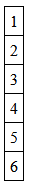
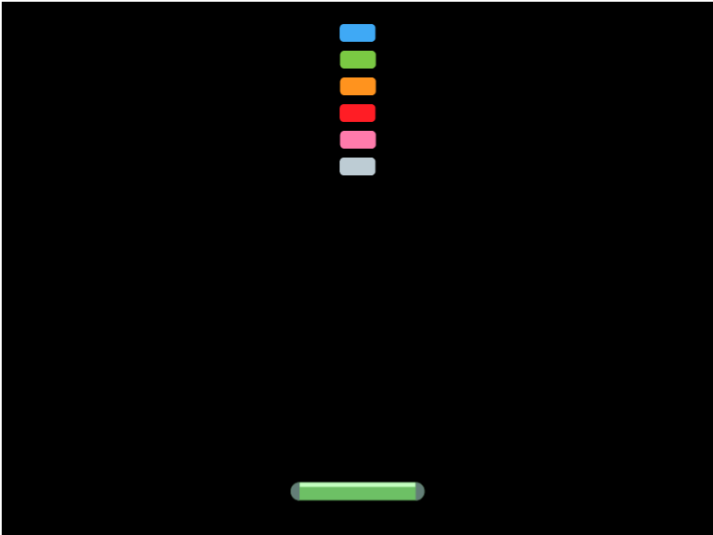

```javascript
const levelMap = [
  [1],
  [2],
  [3],
  [4],
  [5],
  [6]
]
```

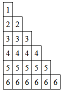
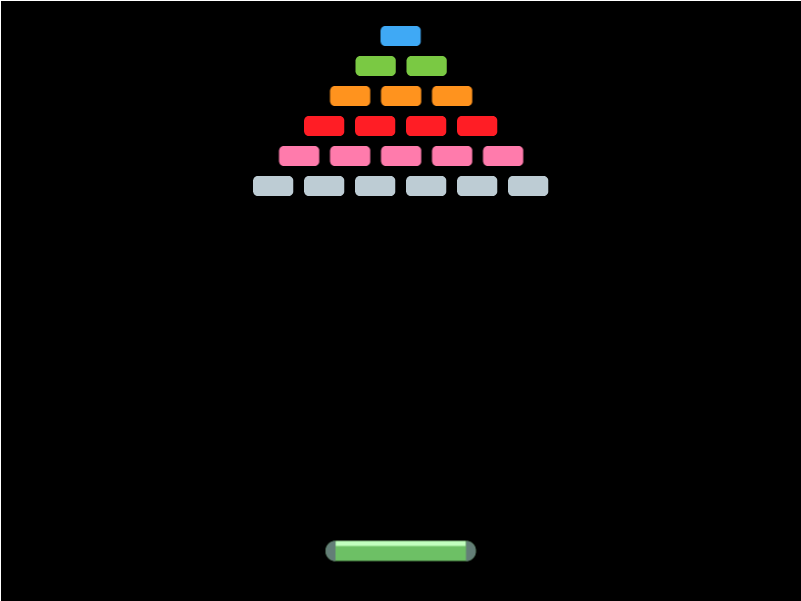

```javascript
const levelMap = [
  [1],
  [2, 2],
  [3, 3, 3],
  [4, 4, 4, 4],
  [5, 5, 5, 5, 5],
  [6, 6, 6, 6, 6, 6]
]
```

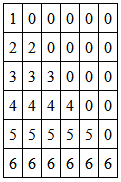
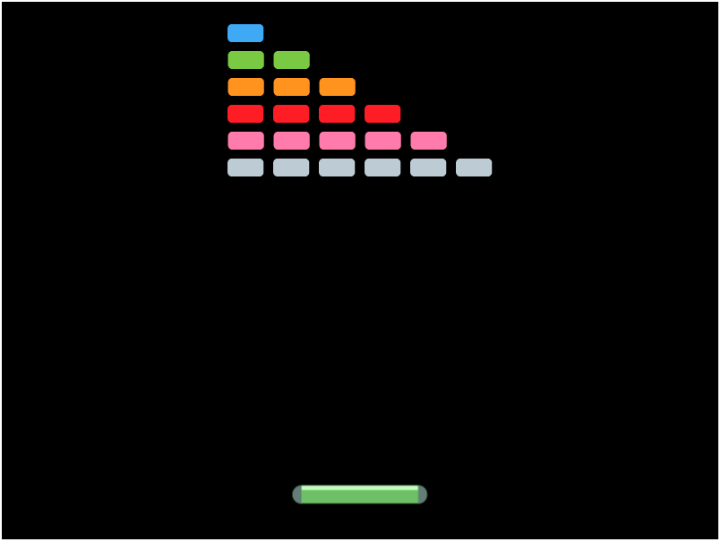

```javascript
const levelMap = [
  [1, 0, 0 ,0 ,0 ,0],
  [2, 2, 0, 0, 0, 0],
  [3, 3, 3, 0, 0, 0],
  [4, 4, 4, 4, 0, 0],
  [5, 5, 5, 5, 5, 0],
  [6, 6, 6, 6, 6, 6]
]
```
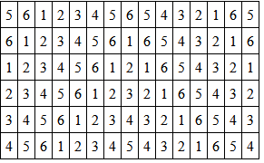
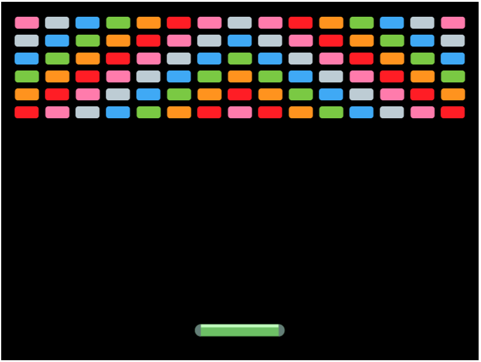

```javascript
const levelmap = [
  [5 ,6 ,1 ,2 ,3 ,4 ,5 ,6 ,5 ,4 ,3 ,2 ,1 ,6 ,5],
  [6 ,1 ,2 ,3 ,4 ,5 ,6 ,1 ,6 ,5 ,4 ,3 ,2 ,1 ,6],
  [1 ,2 ,3 ,4 ,5 ,6 ,1 ,2 ,1 ,6 ,5 ,4 ,3 ,2 ,1],
  [2 ,3 ,4 ,5 ,6 ,1 ,2 ,3 ,2 ,1 ,6 ,5 ,4 ,3 ,2],
  [3 ,4 ,5 ,6 ,1 ,2 ,3 ,4 ,3 ,2 ,1 ,6 ,5 ,4 ,3],
  [4 ,5 ,6 ,1 ,2 ,3 ,4 ,5 ,4 ,3 ,2 ,1 ,6 ,5 ,4]
];
```

Je mag een van deze `levelmap`s buiten de klasse toevoegen aan je code.

Vervolgens gaan we in een functie elke rij overlopen. Voor elke rij gaan we de `startXPosition` bepalen op basis van het aantal blokken en de breedte van de blokken.

Nadien gaan we elke blok op een bepaalde X en Y positie plaatsen aan de hand van de functie `addBlock()`

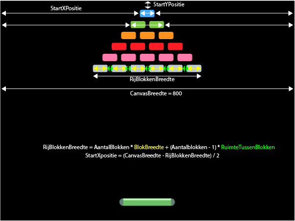

De startPositie van y is steeds dezelfde. De startPositie voor x moeten we per rij opnieuw berekenen. Hier is dus een lus voor nodig. 

```javascript
...
const BLOCK_WIDTH = 41;
const BLOCK_SPACE = 5;
...

class MyGame extends Phaser.Scene
{
  ...
  loadBlocks()
  {
    const startYPosition = 20;
    for(let rowNumber = 0; rowNumber < levelmap.length; rowNumber++)
    {
      const numberOfBlocks = levelmap[rowNumber].length;
      const blockRowWidth = numberOfBlocks * BLOCK_WIDTH + (numberOfBlocks-1) * BLOCK_SPACE;
      const startXPosition = (this.renderer.width - blockRowWidth) / 2;
    }
  }

  ...
}
```

* In de for lus stellen we een variabele in die gaat bijhouden op welke rij we zijn. Vervolgens gaan we deze lus herhalen zolang deze variabel `i` kleiner is dan de lengte van het levelmap. Dit wil zeggen dat we elke rij gaan overlopen.
* `const numberOfBlocks = levelmap[i].length;` = hiermee hallen we het aantal blokken in deze rij op. Levelmap is een array, dus we kunnen de inhoud hiervan krijgen aan de hand van `[positie]`. Dit geeft ons terug een array van blokken terug. Hiervan willen we het aantal weten dit kunnen we met de `length` property opvragen.
* `this.renderer.width` geeft de breedte van het canvas terug
* We voegen ook 2 constanten toe zodat we niet met losse nummers aan het werken zijn.

Vervolgens gaan we de blokken toevoegen. De positie van een blok is afhankelijk van de startpositie en het hoeveelste blok dit is. Ook moeten we er rekening mee houden dat de positie die we meegeven aan de functie `addBlock` het center is van dit blok.

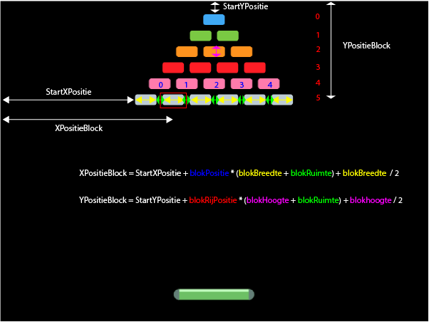

```javascript
...
const BLOCK_WIDTH = 41;
const BLOCK_SPACE = 5;
const BLOCK_HEIGHT = 20;
...

class MyGame extends Phaser.Scene
{
  ...
  loadBlocks()
  {
    ...
    for(let rowNumber = 0; rowNumber < levelmap.length; rowNumber++)
    {
      ...

      for(let blockNumber = 0; blockNumber < levelmap[rowNumber].length ; blockNumber++)
      {
        const block_id = levelmap[rowNumber][blockNumber];
        if(block_id != 0)
        {
          const block_key = 'block_' + block_id;
          const xPositionBlock = startXPosition + blockNumber * (BLOCK_WIDTH + BLOCK_SPACE) + BLOCK_WIDTH / 2;
          const yPositionBlock = startYPosition + rowNumber * (BLOCK_HEIGHT + BLOCK_SPACE) + BLOCK_HEIGHT / 2;
          this.addBlock(xPositionBlock, yPositionBlock, block_key); 
        }
      }
    }
  }

  ...
}
```

In bovenstaande code schrijven we opnieuw een lus. Nu blijft de lus lopen zolang er blokken in de rij zitten.

* Eerst halen we het `block_id` op. Als het `block_id` 0 is, dan hoeven we niets te doen.
* In de code daarna maken we een variabele `block_key`. Deze zullen we nadien gebruiken om het juiste blok in te laden.
* Vervolgens berekenen we zoals in de afbeelding afgebeeld de positie van het nieuwe blok.
* Tot slot plaatsen we het blok op ons canvas via de functie `addBlock`

We moeten nu nog één aanpassing maken om dit te doen werken. In de `create` functie moeten we de functie `addBlock` verwijderen. In plaats daarvan roepen we hier nu de functie `loadBlocks` aan.

```javascript
create() 
{
  ...
  this.loadBlocks();
  ...
}

```

## Game starten en beëindigen
In dit deel gaan we de laatste zaken toevoegen. We gaan er voor zorgen dat het spel pas start wanneer we dit aangeven, we houden een score en levens bij en het spel stopt wanneer alle blokken weg zijn of wanneer alle levens op zijn.

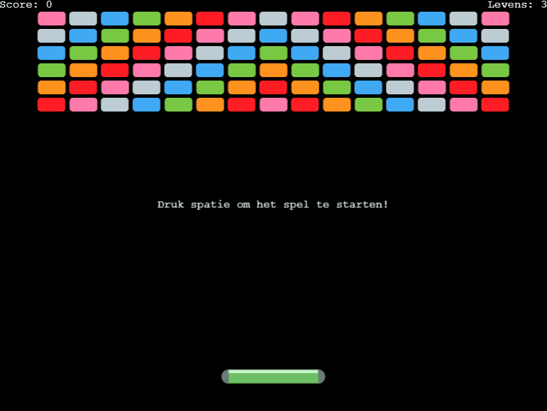  

### Game starten met de spatiebalk

Om dit te doen hebben we geen nieuwe kennis nodig. Veel van wat we tot nu toe reeds gebruikt hebben kan je gebruiken.

De aanpassingen die je hiervoor dient te maken zijn de volgende
* Voorzie een nieuwe key input bij spatie
* Controleer in de `update` functie of er op de spatiebalk is geklikt
* De snelheid van de bal mag niet ingesteld zijn in de `create` functie maar slechts wanneer de spatie wordt ingedrukt
* Voorzie een klasse variabele die bijhoud of het spel gestart is. De spatiebalk mag enkel gebruikt worden wanneer het spel nog niet gestart is.

### Een startboodschap tonen
We willen de speler verwelkomen in het spel of toch op zijn minst laten weten dat de spatiebalk gebruikt moet worden om te starten met spelen.
Hiervoor gaan we tekst toevoegen aan het scherm. 

Tekst kan je toevoegen op dezelfde manier zoals een image. In dit geval hoeft dit wel niet uit de physics property te komen

```javascript
create()
{
  this.add.text(400, 300, 'Druk op spatie om het spel te starten').setOrigin(0.5, 0.5);
}
```

We voegen hier een functie setOrigin aan toe. Bij tekstelementen worden gepositioneerd ten opzichte van hun linkerbovenhoek. We willen deze tekst net zoals onze images positioneren ten opzichte van het midden punt. De 2 parameters die we toevoegen zijn de x en y origin. Hiermee laten we weten dat de origin op 50% van de breedte en 50% van de hoogte moet ingesteld worden.

Voeg dit object toe aan een klasse variabele en noem deze `centerText`. Later gaan we deze nog gebruiken voor andere boodschappen. Wanneer het spel gestart is kan je deze verbergen met onderstaande code.


```javascript
this.centerText.setVisible(false);
```

Je kan dezelfde functie ook gebruiken om de bal zichtbaar en onzichtbaar te maken wanneer het spel niet gespeeld wordt.

### Einde spel - Game Over
In het spel hebben we 3 levens. Telkens wanneer de bal de onderkant van het scherm raakt verliezen we een leven en willen we het spel kunnen herstarten met de spatiebalk. Wanneer de levens op zijn zien we een game over boodschap en kunnen we het spel niet meer spelen.

#### Levens bij houden
Een eerste stap die we gaan ondernemen is het bij houden van levens. Maak een klasse variabele en noem deze `lives`. Stel deze standaard in op 3. Indien je later wil kan je deze ook steeds verhogen of verlagen.

#### Levens tonen op het scherm
Maak in de `create` functie een textelement aan dat je terug aan het klassevariabele toekent, noem deze variabel livesText. We moeten later de score eenvoudig kunnen aanpassen. Positioneer dit element rechtsboven. Door de origin op 0, 1 in te stellen kan je dit eenvoudig uitlijnen.

#### Levens aanpassen wanneer de bal de grond raakt
In de `update` functie kunnen we valideren of de y-positie van de bal groter of gelijk aan is aan de hoogte van het canvas. Indien dit zo is, dan raakt de bal de onderkant van het canvas.

``` javascript
update(time, delta)
{
  ...

  if(this.ball.y >= this.renderer.height)
  {
    ...
  }
}

```

Wanneer we in deze selectie komen dan moeten onderstaande zaken gebeuren
* Het spel wordt gepauzeerd, de variabele `gameStarted` wordt op false geplaatst.
* Het aantal levens wordt met 1 verminderd
* De tekst voor de levens wordt aangepast. Dit kan je doen met behulp van de `setText('new text')` methode van het `livesText` element.
* De snelheid van de bal wordt op 0 ingesteld
* De positie van de bal wordt terug ingesteld naar de startpositie. Dit kan je doen met de functie `setPosition(x,y)` op het bal element.
* Je kan eventueel de bal onzichtbaar maken
* Wanneer het aantal levens groter is dan 0, dan tonen we de tekst **Druk spatie om te starten**
* Indien het aantal levens gelijk is aan 0, toon dan de tekst **GAME OVER**
* Zorg er ook voor dat het spel niet kan gestart worden als het aantal levens 0 is.

### Score toevoegen
We willen ook een score zien. Maak hiervoor een score variabele op klasse niveau en stel deze in op 0. Net zoals bij levens willen we deze zien staan. Voeg hiervoor terug een tekstelement toe en plaats deze links in het scherm. Zorg dat ook dit element wordt opgeslagen in een klasse variabele.

In de functie `removeBlock` gaan we de score verhogen met 1 en gaan we dit ook moeten updaten op het scherm de code die je hiervoor zou schrijven zou er als volgt moeten uitzien.

```javascript
removeBlock(block, ball) 
{
  block.destroy();
  this.score++;
  this.scoreText.setText('Score: ' + this.score);
}
```

Deze code lijkt niet te werken. Dit komt doordat deze functie een callback functie is van de collider die we gemaakt hebben in de `addBlock` functie. De scope van de klasse verdwijnt door deze callback functie. We kunnen deze toevoegen aan de collider door de collider te vervangen door deze code.

```javascript
  this.physics.add.collider(block, this.ball,this.removeBlock,null,this);
```

De laatste parameter in deze functie zorgt ervoor dat de scope bewaard wordt en we wel kunnen verwijzen naar de klasse variabelen.

### Einde spel - You won
Om te weten of een speler gewonnen is, moeten we valideren dat alle blokken verdwenen zijn.
De eenvoudigste manier om dit te doen, is alle blokken aan een array toevoegen en telkens wanneer een blok geraakt wordt dit blok uit de array te verwijderen. Wanneer de array leeg is, kan je ervan uitgaan dat alle blokken weg zijn.

```javascript
class MyGame extends Phaser.Scene
{

  ...
  blocks = [];

  addBlock(x, y, block_id){
    ...
    this.blocks.push(block);
  }

  removeBlock(block, ball) 
  {
    ...
    const index = this.blocks.indexOf(block);
    this.blocks.splice(index, 1)


    if(this.blocks.length == 0) 
    {
     ...
    }
  }
}
```

* Met de functie `push` kan je elementen toevoegen aan een array.
* Met de functie `indexOf` kunnen we de index van een element opvragen
* Met de functie `splice` kunnen we element verwijderen. We geven hierbij de index van het element weer en hoeveel elementen er vanaf die locatie verwijderd moeten worden. In dit geval is dit 1.
* Met de property `length` kunnen we de lengte van de array opvragen. Wanneer deze 0 is moeten we enkele zaken doen.

Wanneer de blocks array 0 is, willen we dat onderstaande acties gebeuren.
* Op het scherm komt een boodschap **YOU WON**
* De snelheid van de bal wordt ingesteld als 0 en wordt onzichtbaar gezet.

## Uitbreidingen
De basis van het spel is klaar. Nu kunnen we het spel interessanter gaan maken door uitbreidingen te implementeren. Hieronder kan je kort enkele uitbreidingen vinden en welke tools van phaser je hiervoor kan gebruiken.

### Versnellingen
Een spel blijft pas leuk als het ook gradueel moeilijker wordt. Je kan het spel moeilijker maken door telkens wanneer de bal het pallet raakt, de bal sneller te laten gaan. Hiervoor ga je ook aan de collider van de bal met het pallet een callback functie moeten toevoegen. Hierin kan je dan instellen dat de snelheid (velocity) van de bal iets meer is dan voordien.

### Bots hoek
Aangezien de bal nu steeds met een hoek van 45° bots, is het spel zeer voorspelbaar. We kunnen het spel interessanter maken door een andere botshoek te implementeren. Hiervoor zijn er verschillende aanpakken die we kunnen volgen. Echter moeten we wel rekening houden dat de bal steeds bots in een hoek die ligt tussen 190° en 350° ligt. Een hoek van 0° zou de bal horizontaal naar rechts zou laten bewegen. De hoek vergroot in de wijzers van de klok. Wanneer de bal onder een hoek van 90° beweegt gaat de bal recht maar beneden.

De richting van de bal kunnen we instellen met deze code.

```javascript
this.physics.velocityFromAngle(hoek, snelheid, this.ball.body.velocity);
```

De richting van de ball kan je ophalen aan de hand van deze code
```javascript
this.ball.body.velocity.angle();
```
positive
: TIP: wanneer je dit probeer uit te werken maak voor jezelf een tekening hoe je dit kan berekenen zoals we gedaan hebben bij het plaatsen van de blokken.

#### Random hoek
Een mogelijke benadering is om telkens een willekeurige hoek te kiezen waarmee de bal botst

#### Absolute botslocatie
Je kan ook op basis van de positie waarbij de bal het pallet raakt een andere hoek instellen. Bijvoorbeeld als de bal in het midden botst gaat de bal recht omhoog. Botst de bal uiterst links op het pallet dan gaat de bal botsen met een hoek van 190°. Botst de bal uiterst rechts op het pallet dan zal de hoek 350° zijn. Botst de bal er ergens tussen dan kan je op basis van de locatie de juiste hoek berekenen.

#### Relatieve botslocatie
We kunnen ook een gelijkaardige benadering als hierboven gebruiken maar de bestaande hoek afhankelijk van de botslocatie vermeerderen of verminderen. 
Dit wil zeggen botst de ball exact in het midden, dan blijft de hoek dezelfde. Botst de bal uiterst links kan je bijvoorbeeld 30° verkleinen, botst de bal uiterst rechts kan je de hoek met 30° vergroten. Ook hier als de bal ergens tussen in kan je dan de juiste hoek bereken. 

#### Bewegende botsing
De meest logische, maar moeilijkste benadering, is dat wanneer het pallet stil staat we de natuurlijk botsing laten plaats vinden. 

Wanneer de botsing plaats vindt wanneer ook het pallet in beweging is, passen we de hoek aan. Hierbij moeten we de hoek berekenen op basis van de richting van de bal, de richting van het pallet en de locatie van de botsing.

* Bal komt van links, pallet gaat naar links => de hoek wordt groter, hoe meer het pallet naar rechts geraakt wordt hoe groter de hoek die toegevoegd wordt.
* Bal komt van links, pallet gaat naar rechts => de hoek wordt kleiner, hoe meer het pallet naar links geraakt wordt hoe groter de hoek die toegevoegd.
* Bal komt van rechts, pallet gaat naar links => de hoek wordt groter, hoe meer het pallet naar rechts geraakt wordt hoe groter de hoek die toegevoegd wordt.
* Bal komt van rechts, pallet gaat naar rechts => de hoek wordt kleiner, hoe meer het pallet naar links geraakt wordt hoe groter de hoek die toegevoegd.

### Hardnekkige blokken
We kunnen ook blokken toevoegen die we meerdere keren moeten raken. Hiervoor zouden we kunnen gebruik maken van de nummers van een blok. Waarbij het nummer staat hoeveel keer een blok moet geraakt worden. 

We kunnen dit bijhouden in het blok. We kunnen aan een blok data toevoegen en diezelfde data ook terug opvragen. 

```javascript
block.setData('hits', 5);
block.getData('hits');
```

### Special items
Wat in het originele spel ook nog aanwezig is, zijn special items die uit de blokken vallen. Wanneer je die vangt krijg je extra voordelen of nadelen.

Dit kan van alles zijn maar enkele ideeën zijn:
* Meerdere ballen 
* Sticky pallet, waarbij je de bal steeds vangt en zelf terug kan afschieten
* Groter pallet
* Kleiner pallet
* Sneller pallet
* Trager pallet
* Extra punten
* Shooter
* ...

Hiervoor moet je zelf nog images toevoegen die kunnen vallen. De meest logische manier om deze te laten vallen is met zwaartekracht. We maken dus geen gebruik van snelheid (velocity), maar van versnelling (acceleration).

Deze kan je instellen met behulp van onderstaande code:

```javascript
this.item.setAccelerationY(100);
```
Dit zorgt ervoor dat het item steeds iets sneller valt, net zoals zwaartekracht ervoor zorgt.

Wanneer het item het pallet raakt kan je dan de nodige acties uitvoeren. Let er wel op dat je mogelijks enkele regels moet veranderen of anders moet implementeren.

### Documentatie

De documentatie van phaser kan je vinden via deze link [deze link](https://photonstorm.github.io/phaser3-docs/index.html).